# CVortex

**Карьера — в контексте.**

CVortex помогает искать работу и готовить отклики на основе подтверждённых фактов о вашей карьере. Система сопоставляет ваш опыт с требованиями вакансии, а каждое утверждение в черновике можно проверить по источнику.

## Текущее состояние

Этапы M1.1–M1.3 реализованы. Реализация M1.4 находится в `stage`. Проверка Preview 0.1 с реальными пользователями и сбор отзывов ещё не завершены. M2 пока не начат.

## Что уже работает

- Вход по приглашению и отдельное рабочее пространство для каждого пользователя.
- Факты о карьере можно добавлять вручную — для этого ИИ не нужен. Можно также вставить текст и получить кандидатов в факты; подтвердить их должен человек.
- Текст вакансии можно вставить в CVortex: система выделит требования, сопоставит их с подтверждённым опытом по семи направлениям и объяснит рекомендацию по приоритету.
- После анализа вакансии можно получить рекомендации по резюме и два черновика сопроводительного письма — краткий и стандартный. Черновики можно изменить, принять или отклонить. Утвердить можно только принятую версию, прошедшую проверку достоверности.

Извлечение фактов, анализ вакансии и подготовка черновиков требуют подключённого сервиса ИИ. В новой установке он выключен: `AI_PROVIDER=none`. Ссылка на вакансию сохраняется только как справочная информация — CVortex не открывает её и не загружает страницу.

## Как проходит работа

```mermaid
flowchart LR
  Invite[Получить приглашение и войти] --> Facts[Подтвердить факты о карьере]
  Facts --> Vacancy[Вставить текст вакансии]
  Vacancy --> Match[Посмотреть совпадения и пробелы]
  Match --> Drafts[Подготовить и проверить черновики]
  Drafts --> Guard[Проверить достоверность]
  Guard --> Approval[Явно утвердить материал]
  Approval --> Stop([Остановиться до отправки])
```



Полная [карта процессов](docs/00-Home/Process-Map.md) показывает происхождение данных, запуск локальной версии и разбор ошибок.

## Запуск на своём компьютере

Нужны Git, Make, Docker с Compose и запущенный Docker Engine. В терминале выполните:

```sh
git clone https://github.com/filatelist-hitech/CVortex.git
cd CVortex
make init
docker compose --env-file .env config --quiet
make up
make migrate
health_authority="$(docker compose port nginx 80)"
curl -fsS "http://${health_authority}/api/v1/health/ready"
```

Когда проверка готовности завершится успешно, откройте адрес `APP_URL` из локального файла `.env` (по умолчанию `http://localhost:8080`). Подробности установки и устранения проблем — в разделе [Локальная установка](docs/10-Operations/Local-Development.md). Как создать администратора и пригласить человека — в инструкции [Первый вход и управление доступом](docs/10-Operations/M1-Access-Core.md).

## Документация

- [Руководство пользователя](docs/00-Home/User-Guide.md) — вход, факты о карьере, вакансии и черновики.
- [Карта процессов](docs/00-Home/Process-Map.md) — Preview, происхождение данных, локальный запуск и диагностика.
- [Разбор ошибок](docs/00-Home/Error-Center-User-Guide.md) — что делать пользователю и администратору.
- [Карта документации](docs/00-Home/Documentation-Map.md) — остальные пользовательские и технические материалы.
- [План развития](docs/01-Product/Roadmap.md) — выполненные этапы и дальнейшие планы.

## Чего пока нет

CVortex пока не создаёт готовые файлы DOCX/PDF и не отправляет отклики работодателям. Подключение MCP выключено по умолчанию; если его включить, инструменты смогут только читать данные. В фактах о карьере, вакансиях и черновиках могут быть личные сведения — не добавляйте их в Git вместе с паролями и ключами.

## Как внести вклад

Порядок работы с репозиторием описан в [CONTRIBUTING.md](CONTRIBUTING.md).
