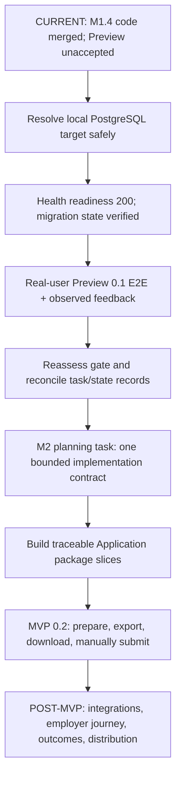
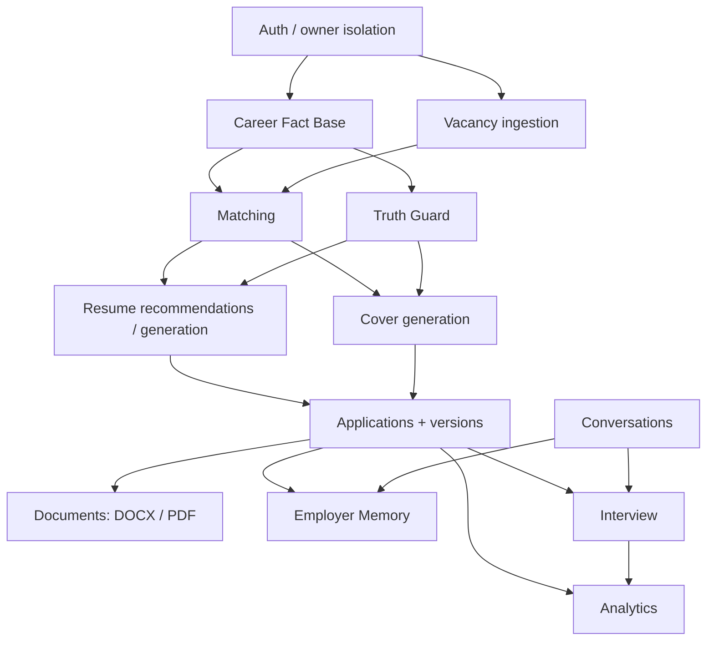

# Аудит текущего состояния CVortex

## Границы и правило доказательств

Аудит опирается на checkout `a599330bbaec5ff957bd6d6600136b97c2a83655`. На момент проверки 2026-10-03 этот SHA совпадал с `origin/stage`. Проверены исходный код, миграции, тесты, task specs, ADR, продуктовая и операционная документация, GitHub PR/CI и доступные локальные health checks.

`DONE` означает, что реализация подтверждена тестами, проверками или документацией, если оценивается сам документ. Описание функции само по себе реализацию не подтверждает. Live-проверки в этом отчёте относятся только к действиям текущей сессии. Записи из `STATUS.md` приведены как историческое evidence и не считаются повторными запусками.

Внешние исследования в аудит не входили. Перед реализацией нужно заново проверить версии, модели, API, цены, лицензии и условия внешних площадок.

**Результат аудита: PASS.** В отчёте зафиксированы состояние проекта, найденные противоречия, blockers и последовательность ограниченных задач. Непроверенные live-переходы помечены отдельно.

## 1. Краткий вывод

CVortex прошёл Foundation Era. В коде уже есть первый вертикальный продуктовый срез: приглашения и вход, база подтверждаемых фактов о карьере, вставка и анализ вакансии, объяснимый матчинг и сохраняемая подготовка отклика с рекомендациями и черновиками писем. До MVP ещё далеко: приложение не проходит readiness из-за локального подключения к отсутствующей базе `cvortex2`, пользовательский Preview 0.1 E2E и обратная связь не записаны, M2 не начинался.

Код M1.4 уже находится в `stage`, а Preview 0.1 пока заблокирован. По `PROJECT.md`, `STATUS.md` и merged PR #28 последний завершённый продуктовый slice: M1.3. В его task spec до сих пор стоит старый статус `changes-required-remediation-awaiting-review`; он расходится с историей merge и состоянием проекта. PR #31 принёс код M1.4. Пользовательская приёмка ещё не пройдена.

До MVP foundation в основном завершён. Core domain и draft workflow реализованы в пределах M1; application package, документы, Employer Memory и полный lifecycle отклика ещё отсутствуют.

### Пять работающих частей по репозиторию

1. Invite-only вход и first-party session API реализованы; есть негативные проверки доступа и владения данными. Актуальный Quality workflow прошёл на точном audited SHA. В этой сессии полноценная регистрация пользователя не выполнялась.
2. Career Core умеет сохранить источник, выдавать extracted facts как `PENDING`, принимать ручные подтверждённые факты и связывать Claims с provenance; `TrustedCareerQuery` фильтрует пригодные для продукта подтверждённые факты.
3. Vacancy Core принимает вставленный текст, сохраняет snapshot, извлекает требования при настроенном AI и выдаёт детерминированный разбор dimensions/gaps/recommendation. URL остаётся метаданными и не загружается.
4. M1.4 содержит сохранённую подготовку отклика, resume recommendations, short/standard cover drafts, редактирование, повторную проверку Truth Guard, историю ревизий и явное локальное одобрение без отправки работодателю.
5. В коде есть ограниченный read-only MCP gateway и Error Center/structured diagnostics. Локальный homepage отвечает `200`, Redis отвечает `PONG`, Horizon сообщает `running`. API и Preview пока не готовы.

### Пять главных отсутствующих частей

1. Preview 0.1 не принят: нет записанного настоящего user E2E и наблюдаемой обратной связи.
2. Application package M2 отсутствует: нет полноценной `Application`/Company lifecycle, application status history, ResumeVersion/CoverLetter versions и детерминированного `READY_TO_APPLY`.
3. DOCX/PDF экспорт, шаблоны, защищённые скачивания и валидация готовых файлов не реализованы.
4. Employer Memory и блокировка/разрешение подтверждённых противоречий по работодателю не реализованы.
5. URL/job-board ingestion, файловый импорт резюме, разговоры и интервью отсутствуют; они запланированы на более поздние milestones.

### Главные риски

- Локальный backend настроен на PostgreSQL `cvortex2`, которой нет в подключённом volume. `/api/v1/health/ready` отвечает `503`, а `migrate:status` падает до чтения миграций. Любая Preview-проверка в этом окружении сейчас не пройдёт.
- Task statuses M1.3/M1.4 расходятся с фактической историей merge и `PROJECT.md`.
- Quality CI запускает backend suite с SQLite и пропускает PostgreSQL-only тесты. Поэтому CI green не проверяет PostgreSQL RLS/concurrency на этом commit.
- Career ownership в приложении и базе имеет менее строгий DB-level boundary, чем Vacancy/Application. Эту разницу нужно оценить; аудит не подтвердил межпользовательскую эксплуатацию.
- Figma visual baseline не прошёл human review. Скриншоты и кодовые проверки не заменяют эту проверку.

Сначала нужно безопасно восстановить локальную готовность, сохранив существующие данные, затем пройти Preview 0.1 с реальным пользователем. После этого можно переходить к M2 planning task.

## 2. Текущая позиция на дорожке

```text
VISION
  ↓
FOUNDATION 00–07 — DONE как историческая основа
  ↓
ARCHITECTURE — приняты 21 актуальный ADR; ADR-0020 superseded
  ↓
INFRASTRUCTURE — службы запускаются, но текущий backend readiness не проходит
  ↓
CORE DOMAIN — M1.1 и M1.2 закрыты; M1.3 код есть, task-state расходится
  ↓
VACANCY WORKFLOW — вставка/анализ/матчинг реализованы для M1
  ↓
APPLICATION WORKFLOW — M1.4 сохранённые draft/review/approval реализованы
  ↓
PREVIEW 0.1 — BLOCKED: readiness 503 и нет user E2E/feedback evidence
  ↓
M2 PLANNING — BLOCKED до Preview evidence
  ↓
MVP 0.2 — ещё не достигнут
```

| Стадия | Статус | Основание | Что ещё нужно |
|---|---|---|---|
| Phases 00–07 | DONE, исторические | Roadmap и завершённые design/research документы | Повторно открывать только при новом решении/свидетельстве |
| Legacy Phase 08–12 | Заменены | Legacy specs оставлены как requirement inventory; текущий порядок: milestones M0–M6 | Не использовать как execution authority |
| M0 Runnable Core | PARTIAL в текущем окружении | Compose, Nginx и frontend работают; `GET /` = 200; readiness = 503 | Сверить целевую БД с volume и получить `/ready` = 200 без удаления данных |
| M1.1 Access Core | DONE | Auth routes/controller, task history, тесты и состояние проекта | Нет обязательного незавершённого пункта в текущем state |
| M1.2 Career Core | DONE | Career services/migrations/tests и completed status | Импорт DOCX/PDF намеренно отложен до M3 |
| M1.3 Vacancy Core | INCONSISTENT | Project/Status и PR #28 называют slice завершённым; task spec всё ещё отмечен как remediation awaiting review | Синхронизировать lifecycle status task spec после сверки merge evidence |
| M1.4 Application Draft | PARTIAL | Код внедрён и PR #31 merged; `PROJECT.md` фиксирует отсутствие Preview acceptance | Реальный Preview E2E и feedback |
| Preview 0.1 | BLOCKED | Нет user acceptance; текущий DB mapping ломает readiness | Восстановить ready runtime, затем пройти критерии task spec |
| M2 planning | BLOCKED | Task spec ожидает Preview evidence; `NEXT.md` запрещает начать раньше | Только после сохранения Preview evidence и явной reassessment |
| M2 implementation / MVP 0.2 | NOT STARTED | Ни task plan по результатам Preview, ни application package нет | Сначала закончить M2 planning task |
| M3–M6 | NOT STARTED | Есть только roadmap level requirements | Не расширять scope до доказанной потребности |

## 3. Матрица возможностей

| Подсистема | Статус | Фактическая граница |
|---|---|---|
| Development Agent System | PARTIAL | Есть root/scoped `AGENTS.md`, policies, workflows, templates, task specs, state и contract scripts. Lifecycle некоторых task specs не синхронизирован с merge history. |
| Product documentation | PARTIAL | Vision, Principles, Scope, Roadmap, Glossary, User Guide и Documentation Map есть; отдельные полноценные PRD/MVP-Scope/Requirements документы не найдены. Process Map покрывает главные flow, но не все product areas. |
| Research | PARTIAL | Phase 03/04 индексированы и отмечены reviewed; MCP research обновлён отдельно. Большинство источников датировано 2026-09-12, к времени аудита ещё в своих `review_after`, но изменчивые модели/цены/API нужно обновлять до связанной реализации. |
| Architecture | DONE | Решения приняты и индексированы. Текущий код в основном следует архитектуре, а отложенные ADR элементы являются явными future scope, не притворной реализацией. |
| Infrastructure | PARTIAL | Все основные Compose services подняты и health-marked, но приложение не ready из-за отсутствующей configured database. |
| Auth / multi-user | DONE на уровне slice | Invite registration, login/logout, активный статус, ownership и тесты присутствуют. Password recovery/account recovery flow отсутствует. Реальный пользовательский auth flow в этой сессии не проходился. |
| Career | DONE на уровне M1.2 | Career source/facts/claims, review states, provenance, extraction/manual entry и trusted query существуют. Полная CareerTrack/EmploymentHistory модель/редактор и файловый импорт не реализованы. |
| Truth Guard | DONE для M1.4 candidate content | Есть content/Claim checks, fail-closed review и revalidation после edit. Это не EmployerConsistencyCheck по истории компании. |
| AI runtime | PARTIAL | Есть `LlmProvider`, OpenAI Responses provider, model policy resolver, runtime skills, schemas/prompts, retries и run metadata/cost estimates. Prompt assets версионируются внутри skills, отдельного центрального Prompt Registry нет. Реально подключён один provider; AI выключен по умолчанию; общего multi-agent/workflow orchestration и исполняемого eval harness нет. |
| Vacancies | PARTIAL | Paste → snapshot → extraction → analysis работает как кодовая возможность. URL fetching, adapters, attachments и manual requirement editor отсутствуют. |
| Matching | DONE для текущего среза | Детерминированные explainable dimensions/gaps строятся после успешной extraction по Technical, Experience, Domain, Language, Location, Work format и Salary (где есть данные). Универсального ATS score нет. Первый анализ требует настроенного AI. |
| Applications | PARTIAL | Есть только `ApplicationPreparation`/draft lifecycle. Полноценной `Application` и отслеживания отправленного отклика нет. |
| Resume | PARTIAL | Есть рекомендации и provenance; нет `ResumeVersion`, `ResumeChange` и готового резюме как отдельного файла. |
| Cover | PARTIAL | Есть short/standard text drafts, revision и approval. Нет версии внешнего документа/экспорта. Отдельный RU/EN output setting/acceptance в текущем M1.4 contract не подтверждён; это не блокер, пока такое требование не принято. |
| Employer Memory | NOT STARTED | История claims/salary/conversations компании и `EmployerConsistencyCheck` не найдены в активном коде. |
| Conversations | NOT STARTED | Импорт диалогов и извлечение подтверждаемых фактов отсутствуют. |
| Interviews | NOT STARTED | Подготовка/история интервью отсутствуют. |
| Documents | NOT STARTED | Файловый storage foundation есть, но DOCX templates/generation, LibreOffice conversion, PDF, download и file validation не найдены. |
| Frontend / UX | PARTIAL | Есть access shell, career/vacancy workspace, saved preparation и admin diagnostics. Draft panel содержит loading/empty/error/stale/cooldown states. Навигационные области Applications/Companies/Documents/Research/Settings не являются готовыми продуктовыми разделами; Figma, keyboard/screen-reader и responsive review не проведены. |
| API | PARTIAL | Versioned `/api/v1` и first-party endpoints есть. Из OpenAPI найден только diagnostics spec; полный машиночитаемый контракт остальных API не представлен одним OpenAPI документом. |
| Security | PARTIAL | Strong ownership/RLS для Vacancy и Application, auth protections, prompt-injection validation и redacted diagnostics. Career boundary в основном application/service/FK based и отличается от RLS подхода Vacancy. |
| Testing | PARTIAL | Backend Feature suite, frontend Vitest, отдельные Postgres harnesses и live shell smoke scripts есть. Нет записанного M1.4 real-user E2E, общего browser E2E и исполняемого LLM eval harness в CI. |
| Observability | PARTIAL | Structured logs, request/job/LLM correlation, failed jobs, Error Center и Horizon есть. Реальный diagnostics API в текущем окружении упирается в PostgreSQL недоступную БД; unified cost analytics нет. |
| CI / Developer Experience | DONE для текущих quality gates; PARTIAL для proof | `Quality` на audited SHA успешен; Compose, make commands, governance workflow и scripts существуют. Required CI не исполняет все независимые PostgreSQL concurrency/security harnesses. |

## 4. Что подтверждено имеющимися evidence

Таблица показывает, в каком слое подтверждены код и проверки. Пользовательский Preview flow не проходили.

| Capability | Evidence | Проверка и ограничение |
|---|---|---|
| Access Core | [`AuthController`](../../apps/backend/app/Http/Controllers/AuthController.php), `/api/v1/auth/*` в [`api.php`](../../apps/backend/routes/api.php), `AccessCoreTest.php` | M1.1 отмечен completed; exact-SHA Quality CI зелёный. В текущем аудите вход пользователя не выполнялся. |
| Career facts + Claims | [`CareerFactService`](../../apps/backend/app/Services/CareerFactService.php), [`TrustedCareerQuery`](../../apps/backend/app/Services/TrustedCareerQuery.php), migrations 000003–000007, CareerCore tests | Исторические M1.2 acceptance/runtime проверки зафиксированы в `STATUS.md`; не запускались повторно в этом аудите. Extracted fact остаётся pending до решения человека. |
| Vacancy paste + matching | [`VacancyIngestionService`](../../apps/backend/app/Services/VacancyIngestionService.php), [`VacancyAnalysisService`](../../apps/backend/app/Services/VacancyAnalysisService.php), [`VacancyMatchingService`](../../apps/backend/app/Services/VacancyMatchingService.php), `VacancyCoreTest.php` | Код и тесты есть. Live API невозможно подтвердить: readiness 503. Для первоначальной extraction нужен AI; URL ingestion нет. |
| Saved M1.4 draft | [`ApplicationPreparationService`](../../apps/backend/app/Services/ApplicationPreparationService.php), [`ApplicationTruthGuard`](../../apps/backend/app/Services/ApplicationTruthGuard.php), [`vacancy-workspace.tsx`](../../apps/frontend/src/app/vacancy-workspace.tsx), `ApplicationDraftTest.php` | PR #31 merged; исторические test/review evidence есть в `STATUS.md`. User E2E, edit/approve в текущем browser runtime не проходились. |
| Runtime AI assets | [`runtime-ai/skills`](../../runtime-ai/README.md), [`RuntimeSkillRegistry`](../../apps/backend/app/AI/RuntimeSkillRegistry.php), [`config/ai.php`](../../apps/backend/config/ai.php) | Четыре skill families имеют prompt/schema; adversarial JSON fixtures сохранены. Провайдер задан конфигурацией; default `AI_PROVIDER=none`, без API key генерация недоступна. |
| Local service processes | [`compose.yaml`](../../compose.yaml), [`Makefile`](../../Makefile) | В текущем запуске: backend/frontend/PostgreSQL/Redis/Nginx healthy, Horizon running; `docker compose config --quiet` прошёл; `GET /` вернул 200. Но `/api/v1/health/ready` вернул 503. |
| Quality gate | [GitHub Quality run на audited SHA](https://github.com/filatelist-hitech/CVortex/actions/runs/37125263395) | GitHub сообщил `completed / success` для точного SHA `a599330...`. Workflow выполняет Compose config, `make lint`, `make test` и production frontend build; `make test` принудительно использует SQLite для backend. |
| Error Center / MCP | `DiagnosticsController`, `diagnostic_*` migrations, `McpGatewayTest`, MCP read-only tools and operations guides | Implementation и historical local test evidence есть; внешний ChatGPT/Tunnel E2E не прошёл. API/runtime часть сейчас ограничена PostgreSQL readiness failure. |

## 5. Частично реализованные возможности и критерии завершения

| Область | Уже есть | Не хватает для завершения | Критерий следующего завершения |
|---|---|---|---|
| M0 runtime | Docker Compose, Nginx, PHP-FPM, frontend, PostgreSQL, Redis, Horizon и health endpoints | Текущий `DB_DATABASE=cvortex2` отсутствует в активном volume; сервисы healthy не равны API ready | Подтвердить целевую существующую БД, безопасно согласовать local config, readiness 200 и миграции проверены на верной БД |
| Career / security | Owner checks, owner-chain constraints, claims, provenance, тесты межпользовательского доступа | Для Career не обнаружены те же forced RLS policies, что для Vacancy/Preparation | Либо принять обоснованный и проверенный DB-level isolation boundary, либо закрыть разницу с тестами на реальном PostgreSQL |
| Vacancy / matching | Paste, snapshot, AI requirements, deterministic dimensions/gaps | Нет URL adapters, ручного ввода требований и внешних source controls | Оставить это M3; для M1 достаточно устойчивого paste-to-match path и его Preview acceptance |
| AI runtime | Один provider, Skill manifests, JSON schemas, prompts, usage/run metadata, configured price estimates | Нет провайдера второго типа, общего ModelRouter/Workflow/Agent runtime, LLM eval runner и golden evaluation pipeline | Расширять только отдельным bounded task. Для MVP нужны проверяемые M1 skills и truthful outputs; платформенный orchestration layer в этот scope не входит |
| M1.4 | Рекомендации, short/standard drafts, provenance, revisions, approvals, Truth Guard | Нет real-user flow evidence; статусы task spec не отражают code merge | Пользователь проходит критерии M1.4 и feedback/evidence записываются без приватных карьерных данных в открытых артефактах |
| Дизайн | Git token JSON и CSS semantic subset с комментарием `derived from` | Figma file не рецензировался; JSON→CSS/Figma автоматизация не найдена, frontend parity не подтверждена | Отдельно получить human review Figma и сравнить Git token SHA, UI states, keyboard/focus/contrast/reflow |
| API contract | `/api/v1`, route validation, domain docs | Один OpenAPI-файл только для diagnostics; остальные route contracts разнесены по task/data docs | До роста клиентов определить bounded OpenAPI coverage для поддерживаемых first-party endpoints |

## 6. Запланировано, но пока не реализовано

Ниже перечислены планы, которые пока не реализованы:

- Company / полноценная Application / status chronology, ResumeVersion/ResumeChange, CoverLetter versions, readiness checklist и manual `Mark as applied` запланированы в M2.
- DOCX template pipeline, LibreOffice headless PDF, private generated-file storage/download и форматная валидация относятся к M2 и ADR-0015/0016. В текущем backend нет renderer/export path.
- Basic Employer Memory и `EmployerConsistencyCheck` запланированы в M2; advanced conversation/import/interview journey относится к M4.
- Safe DOCX/PDF career import и источники вакансий/URL adapters относятся к M3. В M1 link to vacancy сохраняется как reference, страница не fetch-ится.
- Перечисленные продуктовые области Dashboard, Applications, Companies, Documents, Research, Settings не означают готовые отдельные экраны; фактически первая пользовательская работа идёт через access shell и career/vacancy workspace.
- Общие AI Agents/Workflows/Tools, model escalation/routing framework и eval platform шире текущих runtime skills. В репозитории есть runtime prompt/schema assets и OpenAI boundary, но не полная универсальная AI platform.
- Cloud/VPS, backup/restore, production ops hardening, мобильная полировка и крупная analytics suite запланированы на M6 или позднее.

## 7. Что ещё не начато из MVP scope

Roadmap связывает MVP 0.2 с M2 Real Application Package. Не начаты следующие части, поэтому текущий продукт нельзя назвать application package MVP:

1. Полноценные Company/Application records и status history.
2. Отдельные версионированные resume/cover artifacts и Claim usage на версии.
3. Employer Memory с правилом «подтверждённое противоречие не проходит молча».
4. Deterministic `READY_TO_APPLY` criteria и явное resolution flow.
5. Structured Resume → DOCX → LibreOffice → PDF; private storage/download.
6. Пользовательский ручной статус «сам отправил заявку» и дальнейшее состояние application.
7. Переработанный M2 task plan на основании Preview findings.

Для первого vacancy analysis/draft generation нужна AI-настройка. Расширение AI platform и новые providers не входят в MVP requirements.

## 8. Найденные несоответствия

Ниже перечислены **4 актуальных finding**: два конфликта task lifecycle, один delivery-state drift и одно смешение core/non-core blocker. PostgreSQL mismatch вынесен отдельно. `BLOCKERS.md` описывает его верно, а аудит подтвердил его live.

| ID | Severity | Несовпадение | Воздействие | Необходимая сверка |
|---|---|---|---|---|
| I-01 | HIGH | `.agents/tasks/m1-3-vacancy-core.md` сохраняет `changes-required-remediation-awaiting-review`; `PROJECT.md` говорит M1.3 PASS, `STATUS.md` говорит completed, PR #28 merged | Новый агент может повторно открыть уже завершённый slice или неверно прочитать acceptance | После подтверждения completion обновить lifecycle метаданные task spec и сохранить причину/ссылку на merge |
| I-02 | HIGH | M1.4 task spec имеет `status: ready`, но код и PR #31 уже merged; `PROJECT.md` и `STATUS.md` говорят: implementation merged, Preview acceptance не PASS | Смешаны «готов к запуску», «код выполнен» и «продуктовый gate пройден» | Развести code completion M1.4 и Preview acceptance в статусе/формулировке spec; не ставить Preview PASS без user evidence |
| I-03 | MEDIUM | PR #34 `m4env` остаётся `OPEN` с head `chore/m1.4-preview-env` от 2026-09-26; текущий base уже дальше, `PR contract` и `Roadmap metadata` завершились failure, `m0-quality` — success | Старый delivery lane остаётся видимым рядом с актуальным stage и путает состояние Preview setup | Reconcile PR #34 с merged #38/#39 и текущим `stage`; не считать его готовым к merge |
| I-04 | LOW | `BLOCKERS.md` помещает внешний ChatGPT/Tunnel MCP E2E в один список с Preview/DB blockers. MCP выключен по умолчанию и не входит в MVP | Читатель может принять этот пункт за блокировку M1/M2 | Явно отметить его `non-MVP / external integration blocker`, сохранив `UNKNOWN` для entitlement и tunnel access |

Также найдены три gaps: OpenAPI описывает только diagnostics, остальные маршруты `/api/v1` не сведены в этот документ; отдельного PRD/MVP-Scope документа нет; Figma status отмечен как `BLOCKED`, но не используется как review evidence для frontend.

## 9. Технический долг

### Нужно закрыть до Preview 0.1

- Согласовать Compose `DB_DATABASE=cvortex2` с нужной базой активного volume. В volume перечислены `cvortex` и `cvortex_dev2`; ни одна не должна выбираться наугад. Сначала установить, где целевые данные/схема, затем менять только локальную конфигурацию по этому доказательству. Не удалять volume и не запускать миграции до подтверждения назначения БД.
- Вернуть dependency readiness в `200`, проверить миграционное состояние уже на правильной БД и только затем проходить real-user Preview.
- Записать результат всех Preview acceptance критериев и наблюдаемую feedback без публикации приватных career facts.

### Нужно закрыть в ходе достижения MVP

- M2 application records/history, версии документов, Employer Memory и проверку противоречий.
- Полный export/download pipeline с детерминированной рендеринг-проверкой и безопасной обработкой файлов.
- Решить и проверить database-level isolation для всех private domain tables; в первую очередь объяснить/закрыть отличие Career от Vacancy/Application.
- Уточнить актуальные цены/модели/лицензии/runtime support до добавления новых document/AI dependencies.
- Оформить один bounded M2 implementation task из Preview evidence вместо реализации всех будущих систем разом.

### Может ждать после MVP

- URL/job-board integrations, browser extension и массовая автоматизация импорта.
- Advanced conversation ingestion/interview preparation/employer journey.
- Outcome analytics до появления реальных application outcomes.
- Дополнительные LLM providers/универсальные workers, mobile polish и cloud distribution.
- Backup/restore и production operational hardening по M6 roadmap.

## 10. Security gaps и границы

В доступных материалах аудит не подтвердил exploit path. Он выявил следующие control gaps и ограничения:

- Career таблицы имеют owner/provenance constraints и application-level owner filtering; в открытых migrations не нашёл такой RLS policy, как для `vacancies`, `application_preparations` и связанных M1.4 таблиц. Это меньшая глубина изоляции между доменами. Нужна PostgreSQL проверка прямого доступа/обхода приложения перед расширением данных.
- PostgreSQL-specific authorization/RLS/concurrency tests существуют как отдельные tests/scripts, но обязательный `make test` передаёт backend suite `DB_CONNECTION=sqlite`; последние `11` PG-only skips отражены в историческом status evidence. Green CI на этом commit не подтверждает runtime-role/RLS/concurrency на PostgreSQL.
- Вакансии пока поступают только через вставку текста. URL fetching и file upload не реализованы, поэтому будущие SSRF и malicious-file сценарии ещё не проверены и не защищены.
- BYOK/system-managed credential UX и encrypted-at-rest user secret vault указаны в будущем M2 scope. Сейчас provider key задаётся операторской environment configuration; пользовательский secret management flow не найден.
- Figma canvas, contrast, keyboard, screen-reader и frontend/Figma parity не получили review. Handoff фиксирует реальный Figma file, но reviewer не записан, verdict `BLOCKED`.
- В текущем slice тестируются active-user/auth boundary, same-origin API, owner checks/RLS для Vacancy/Application, controlled untrusted-output validation и structured-log redaction. Runtime checks в этой сессии ограничила ошибка БД.

## 11. Test inventory и пробелы

| Уровень | Что есть | Что покрывает | Текущий статус / пробел |
|---|---|---|---|
| Backend unit/feature | 12 `tests/Feature/*Test.php` групп: Access, Career, Vacancy, Application Draft, Diagnostics, Health, MCP и OpenAI provider | Бизнес-правила, error paths, provenance, access boundaries и provider parsing | Exact-SHA `Quality` CI completed success. Полный suite в этом аудите повторно не запускался. |
| PostgreSQL integration/security | Отдельные Application/Vacancy/Diagnostics PostgreSQL suites плюс concurrency/upgrade scripts | RLS, runtime role, owner isolation, legacy schema/concurrency races | `make test` запускает backend на SQLite; эти suites не равны CI gate и часть пропускается. Не запускались повторно в этом аудите. |
| Frontend component/unit | 4 Vitest test files: homepage/auth, diagnostics, browser error reporting, client instrumentation | Основные access/diagnostics/telemetry interaction contracts | Production UI/E2E по Career → Vacancy → M1.4 не покрыт одним браузерным acceptance flow. CI Vitest прошёл. |
| Live/API smoke | `test-same-origin-auth.sh`, `test-career-first-value-live.sh`, MCP toggle и Nginx log safety scripts | Отдельные auth/Career/MCP/runtime boundaries | Это технические harnesses, не записанная real-user M1.4 Preview acceptance. Не запускались в этой сессии. |
| Browser E2E | Отдельной Playwright suite/dependency не найдено | — | Главный gap для реального Preview navigation/focus/responsive/manual approval. Не подменять его синтетическими скриншотами. |
| LLM evaluations | В runtime skills есть `evals/adversarial.json` fixtures | Враждебные/невалидные входы как test material | Автоматический eval runner, golden dataset и регулярный CI verdict не найдены. |
| Security | Auth/ownership tests, prompt-injection cases, PostgreSQL suites и diagnostics redaction cases | Критичные M1 boundaries | Нужна обязательная PG security/concurrency проверка на exact head перед расширением private data; real-world external input coverage ограничена. |
| Documents | Отдельных renderer/export suites нет | — | Соответствует статусу: pipeline ещё не реализован. |

CI из `.github/workflows/quality.yml` на audited SHA выполняет `make init`, `make lint`, `make test` и production frontend build. Команда `make test` из `Makefile` переключает backend на in-memory SQLite. `governance.yml` проверяет roadmap/PR metadata. Результаты `m0-quality`/Quality для текущего SHA проверены через GitHub; локальные backend/frontend suites в этой audit-сессии не запускались.

## 12. Документация и research: полнота и свежесть

| Материал | Состояние | Наблюдение |
|---|---|---|
| Vision / Principles / Scope / Glossary | Есть | Актуальная product vocabulary и Truth-first направление; Scope отдельно поясняет, что это не список реализованных возможностей. |
| Roadmap | Есть, accepted | Отражает M0–M6 и порядок M1/M2. Метаданные Roadmap датированы 2026-09-12 и описывают план, а текущие статусы задают `PROJECT.md`/`.agents/state/*`. |
| PRD / Requirements / MVP-Scope | Отдельные canonical документы не найдены | Product design, roadmap и bounded task specs частично выполняют эту роль. Границы MVP описаны в M2 task/roadmap; навигация их не определяет. |
| User Flows / User Guide / Process Map | Есть и обновлены 2026-10-03 | Preview flow описан; документы честно отмечают, что acceptance ещё не прошёл и что generated drafts не скачиваются/не отправляются. |
| Documentation Map | Есть, `updated: 2026-10-03` | Текущая навигация разделяет пользовательские, продуктовые и технические материалы и включает ссылку на этот audit report. |
| Domain / data docs | Есть M1.2/M1.3/M1.4 и Phase-06 conceptual docs | Текущую схему определяют migrations. Отдельного ERD-to-migration reconciliation отчёта не найдено; старую conceptual diagram нужно сверять с migrations. |
| API docs | `docs/05-API/diagnostics.openapi.yaml` | OpenAPI полно описывает diagnostics boundary, но не все first-party `/api/v1` routes в одном canonical spec. Другие feature contracts распределены между data docs/tasks. |
| Agent docs / tasks / state | Богатый и маршрутный набор | `NEXT.md` и `BLOCKERS.md` ясно фиксируют Preview gate; task metadata M1.3/M1.4 отстали от delivery evidence. |
| Technical research | Phase 03 в index отмечен REVIEWED | Большинство reports/source registers проверены 2026-09-12; не истёкшие `review_after` не гарантируют актуальность изменчивых vendor facts. |
| Product/integration research | Phase 04 отмечен REVIEWED | Integration terms в основном с review date 2026-12-12; часть platform terms — 2026-10-12. Перед M3 обязательно обновить актуальные API/ToS/licensing/access conclusions. |
| MCP research | Отдельный report обновлён 2026-09-27 | Свежей для локального MCP boundary; external entitlement/tunnel access остаются `UNKNOWN`, не архитектурное основание для M1/M2. |
| Figma/design | Token file есть; Figma file записан | По `Figma-Handoff.md` reviewer отсутствует и verdict BLOCKED из-за MCP plan limit. Frontend/Figma visual parity = NOT VERIFIED. |

Ближайшее развитие сейчас блокируют восстановление DB readiness и Preview acceptance. Перед M2 нужно проверить по официальным источникам лицензии, возможности актуальных renderer/framework и цены моделей, если scope включает документный pipeline или расширение AI.

### Git history и текущая delivery-картина

- M1.3 code/review завершение записано 2026-09-24; PR #27 merged, затем отдельный state PR #28 merged. `PROJECT.md` подтверждает M1.3 PASS.
- M1.4 Application Draft merged PR #31 (2026-09-24); отдельный state PR #32 также merged. M1.4 implementation не равен Preview acceptance: `STATUS.md` прямо оставляет user E2E/feedback невалидированными.
- PR #33 доставил read-only MCP gateway, PR #36 и #37 закрыли observability/Error Center, PR #38 добавил локальный startup guide, а PR #39 обновил пользовательскую и операционную документацию. PR #39 merged на audited `stage` SHA.
- На GitHub остался открытым PR #34 `m4env`/`chore/m1.4-preview-env`, обновлявшийся 2026-09-26. Его Quality прошёл, но актуальные `PR contract` и `Roadmap metadata` не прошли; mergeability в момент проверки `UNKNOWN`. Это не новый canonical task и не свидетельство готового Preview.
- Текущие exact-SHA CI evidence: `Quality` = completed/success. Проверки на remote exact commit не заменяют локальный readiness, real-user Preview или независимые PostgreSQL concurrency harnesses.

## 13. Accepted ADR inventory

В `docs/03-ADR/INDEX.md` перечислено **21 актуальное accepted ADR** и один superseded ADR. Реализация оценивалась по текущему M1/MVP-коду. Элементы ADR, отнесённые к будущим milestones, остаются запланированным scope.

| ADR | Статус и решение | Реализация / соблюдение сейчас | Conflict или пересмотр |
|---|---|---|---|
| 0001 Laravel Core Backend | ACCEPTED — Laravel control plane | Реализован в `apps/backend`, routes/services/migrations/tests | Конфликта не обнаружено |
| 0002 PostgreSQL Primary DB | ACCEPTED — PostgreSQL durable truth | Compose/PostgreSQL и migrations есть; live server healthy | Текущая configured DB отсутствует; нужен runtime config fix, ADR менять не требуется |
| 0003 Redis Queues/Horizon | ACCEPTED — Redis queue + Horizon | Redis отвечает PONG; Horizon CLI сообщает running; async jobs в коде | Полный business job cycle в текущем DB runtime не проверен |
| 0004 API-first Boundary | ACCEPTED — общий `/api/v1` для клиентов | First-party routes используются frontend и интеграциями | API есть; полный OpenAPI document gap зафиксирован |
| 0005 Local-first Compose | ACCEPTED — локальный Docker Compose | Compose, Nginx, PostgreSQL, Redis, PHP-FPM, frontend подняты | Current local ready gate не проходит из-за DB mapping; decision не нарушен, реализация не готова в этой среде |
| 0006 Incremental Monorepo | ACCEPTED — единый репозиторий растёт по потребности | `apps/backend`, `apps/frontend`, `infra`, `docs`, `research`, `runtime-ai`, `brand` существуют | `packages/`/`services/` не созданы и не требуются текущему срезу |
| 0007 Multi-user Ownership | ACCEPTED — shared schema с изоляцией владельца | Owner checks и PG RLS для Vacancy/Application; cross-owner suites существуют | Career не использует тот же forced RLS pattern; требует явной границы и PG evidence |
| 0008 Invite-only Access | ACCEPTED — регистрация только по приглашению | invitation service/commands, register/login, expiry/reuse tests | Согласовано с code |
| 0009 Strict Truth Guard | ACCEPTED — claims должны идти от подтверждённых фактов | Claim/Facts, `TrustedCareerQuery`, M1.4 guard and approval checks | Реализация покрывает нынешний draft slice; Employer Memory consistency — отдельный недоделанный M2 элемент |
| 0010 Provider-independent LLM | ACCEPTED — business logic отделена от provider | Interface и configured OpenAI provider есть; `AI_PROVIDER=none` позволяет fail closed | Только один concrete provider сейчас; это ограничение текущего scope, не нарушение boundary |
| 0011 Logical Model Policy | ACCEPTED — policy maps capability to provider/model/cost | Config mapping/resolver и per-run metadata/cost estimates есть | Нет общего multi-model router/escalation engine; не требуется M1 |
| 0012 Markdown + Obsidian docs | ACCEPTED — Git Markdown является source | `docs/`, maps, frontmatter и relative/Obsidian links | Реализован как документационная архитектура |
| 0013 Figma Visual Source | ACCEPTED — human-reviewed Figma canonical for visuals | Файл и handoff записаны | Human reviewer не записан; Figma verdict BLOCKED, frontend parity UNKNOWN; требуется дизайн review, не ADR reset |
| 0014 Git DTCG Tokens | ACCEPTED — JSON in Git is machine-readable authority | `brand/tokens/cvortex.tokens.json` присутствует; frontend uses semantic token language | Автоматическая синхронизация JSON→CSS/Figma не подтверждена; возможен drift, нужен deterministic contract |
| 0015 File Storage Abstraction | ACCEPTED — private storage interface, initial local driver | Laravel private local disk/config foundation существует | Generated package files/upload/download отсутствуют до M2/M3 |
| 0016 Deterministic DOCX→PDF | ACCEPTED — template + LibreOffice rendering | В текущем runtime/export code path не найден | Не конфликт: milestone ещё не начат; implementation нужен для MVP 0.2 |
| 0017 Untrusted External Content | ACCEPTED — vacancies/sites/files untrusted | Vacancy input/output validators и injection regressions существуют | Текущий ingestion только manual paste; URL/file boundaries ещё предстоит реализовать до их включения |
| 0018 Runtime AI Skills Location | ACCEPTED — product skills live under `/runtime-ai/` | Runtime assets и registry в `runtime-ai/` реализованы; `.agents/` остаётся execution policy | Согласовано |
| 0019 Stateful Sanctum Auth | ACCEPTED — same-origin first-party session auth | Sanctum/session/csrf routes/config/tests есть | Текущий live flow из-за DB не проходится; ADR не противоречит коду |
| 0020 Inbound MCP Gateway | SUPERSEDED by ADR-0021 | Историческое решение сохранено в index | Не считать действующим контрактом |
| 0021 Read-only Inbound MCP | ACCEPTED — ограниченная read-only MCP поверхность | Read tools/OAuth/access checks и default-off config реализованы | Локальные проверки записаны; внешний ChatGPT/Tunnel E2E не доказан и не блокирует MVP |
| 0022 Local Diagnostics | ACCEPTED — safe structured logs/incidents/Error Center | Models/migrations/controller/UI/redaction/recovery metadata есть | Текущий diagnostics backend зависит от неработающего DB mapping; ADR-0022 границы расширять без решения нельзя |

Отсутствие кода M2/M3 само по себе не требует пересмотра принятых решений. Если будущая DB-isolation или Figma/token implementation обнаружит конфликт с ADR, его нужно разобрать через отдельный decision workflow.

## 14. Схема текущего состояния

Статусы отражают код и пройденные gates. Roadmap показывает планируемую работу отдельно.

```mermaid
flowchart LR
    A[Agent OS — PARTIAL] --> B[Research — PARTIAL]
    B --> C[Architecture / accepted ADRs — DONE]
    C --> D[Compose / M0 runtime — PARTIAL]
    D --> E[Access Core — DONE]
    E --> F[Career Facts + Claims — DONE]
    F --> G[Vacancy paste + matching — PARTIAL]
    G --> H[M1.4 saved drafts + Truth Guard — PARTIAL]
    H --> I[Preview 0.1 acceptance — BLOCKED]
    I --> J[M2 application package — NOT STARTED]
    J --> K[MVP 0.2 — NOT STARTED]
```



## 15. Дорожка от текущего состояния до MVP

Сначала нужны evidence Preview и явная переоценка gate. Переход к M2 зависит от их результата.



## 16. Critical path до MVP

`Size` показывает примерную сложность задачи, а не срок. Целевую БД нужно определить по данным. Выбирать `cvortex` или `cvortex_dev2` наугад нельзя.

| Order | Task | Depends on | Why required for MVP | Size | Risk |
|---|---|---|---|---|---|
| 1 | Неразрушающе установить правильную БД/volume и восстановить `/ready` | Проверка существующих DB/volume и подтверждение целевых данных | Сейчас даже нормальный Preview API flow недоступен | S–M | HIGH — нельзя перепутать или стереть пользовательские данные |
| 2 | Пройти Preview 0.1 реальным пользователем и записать наблюдения по acceptance criteria | Task 1; `.agents/tasks/m1-4-application-draft.md` | Это обязательный value checkpoint перед M2 | M | HIGH — без фактического использования M2 scope будет предположением |
| 3 | Сверить M1.3/M1.4 task statuses и current state после evidence | Установленное code merge и результат Preview | State является execution gate для следующих агентов | S | MEDIUM — риск повторной или преждевременной работы |
| 4 | Выполнить M2 application-package planning task и определить один implementation slice | Записанный Preview feedback и reassessment | Канонический вход в M2; не заказывать весь M2 одним PR | M | MEDIUM — scope зависит от evidence |
| 5 | Выполнить первый bounded M2 slice по созданному planning contract | NEXT из task 4; принятые ADR | Начинает переход от draft к полезному скачиваемому package | M–L | MEDIUM/HIGH — ownership, provenance, stale dependency и files |
| 6 | Последующими bounded slices завершить readiness/export/employer consistency и end-to-end проверку | Предыдущие M2 slices и продуктовые решения | Это критерии MVP 0.2 в Roadmap | L/XL суммарно | HIGH — несколько security/data/rendering границ, нельзя сливать в одну задачу |

## 17. Dependency map

Показаны только зависимости, прямо следующие из нынешнего workflow и roadmap. `Auth` оборачивает private resources. Для candidate text Truth Guard зависит от подтверждённых Career claims. Для M2 Employer Memory зависит от сохранённых Applications/Conversation evidence.



## 18. Рекомендуемая последовательность bounded tasks

`NEXT.md` указывает Preview 0.1 real-user E2E как следующую цель. Перед ней нужно устранить DB blocker из `BLOCKERS.md` и выбрать базу по evidence. Миграции запускаются только после проверки целевой БД.

### NEXT-01: безопасно восстановить local PostgreSQL readiness

**Цель:** определить предназначенную существующую БД/volume и вернуть приложение в ready-состояние.

**Почему сейчас:** `DB_DATABASE=cvortex2` отсутствует; `health/ready` сейчас 503. Без работающей DB проверить Preview нельзя.

**Условия:** доступ к текущему локальному Compose/PostgreSQL и возможность установить, где находятся ожидаемые данные. Не выбирать `cvortex` или `cvortex_dev2` без проверки.

**Объём:** исследовать каталоги/схемы безопасными read-only средствами; согласовать local `DB_DATABASE`/`POSTGRES_DB` с существующими данными; не удалять volume и не выполнять миграции до подтверждения целевого состояния.

**Критерии завершения:** правильная DB выбрана по evidence; конфигурация согласована; readiness = 200; migration state проверен без потери прежних данных; результат записан.

**Источники истины:** `.agents/state/BLOCKERS.md`, `.agents/tasks/m0-runnable-core.md`, `docs/10-Operations/Local-Development.md`, `compose.yaml`.

### NEXT-02: пройти Preview 0.1 end-to-end

**Цель:** подтвердить путь invited user → confirmed career facts → pasted vacancy → explainable match → recommendations → Truth Guard → human-approved short/standard cover draft.

**Почему сейчас:** это обязательный product checkpoint перед M2 planning.

**Условия:** NEXT-01; acceptance criteria M1.4 task spec; настроенный AI для первоначальных extraction/generation шагов либо заранее известная допустимая конфигурация.

**Объём:** пройти Preview flow, записать результат каждого acceptance criterion и собрать наблюдаемую обратную связь. Функции работодателя, автосабмит и файловый экспорт в этот flow не входят.

**Критерии завершения:** записаны real-user E2E evidence и feedback; ограничения подтверждены; пропущенные действия не отмечены как PASS; private candidate content исключён или замаскирован в общих артефактах.

**Источники истины:** `NEXT.md`, `BLOCKERS.md`, `.agents/tasks/m1-4-application-draft.md`, `docs/01-Product/Roadmap.md`.

### NEXT-03: reconciliate project state and task lifecycles

**Цель:** синхронизировать код, merge evidence, task specs и canonical state.

**Почему сейчас:** статусы M1.3/M1.4 расходятся с историей merge; статус внешнего MCP смешан с Preview blocker.

**Условия:** подтвердить PR/commit evidence и записать результат Preview.

**Объём:** минимально обновить task lifecycle и `STATUS/NEXT/BLOCKERS` по фактическому результату; не создавать backlog в state и не менять порядок roadmap без decision.

**Критерии завершения:** M1.3 отмечен по фактическому merged acceptance; code completion M1.4 отделён от Preview acceptance; `NEXT` указывает следующую разрешённую задачу; MCP external blocker помечен как non-MVP.

**Источники истины:** `.agents/state/{STATUS,NEXT,BLOCKERS}.md`, `.agents/tasks/m1-3-vacancy-core.md`, `.agents/tasks/m1-4-application-draft.md`, `PROJECT.md`.

### NEXT-04: определить одну bounded M2 implementation task

**Цель:** использовать Preview evidence, чтобы выполнить текущую M2 planning spec и выбрать один наблюдаемый application-package outcome.

**Почему сейчас:** подтверждённый Preview покажет, какой package gap важнее.

**Условия:** Preview evidence/feedback и state reassessment из NEXT-03.

**Объём:** задать одну vertical capability и её data/API/UI/security/test/documentation boundaries. Application lifecycle, generation, documents, Employer Memory и integrations должны остаться отдельными implementation tasks.

**Критерии завершения:** готова одна implementation spec с measurable acceptance, Truth-first provenance, owner isolation, stale-input behavior, PostgreSQL evidence where needed и no auto-submission.

**Источники истины:** `.agents/tasks/m2-application-package-planning.md`, `docs/01-Product/Roadmap.md`, accepted ADRs.

### NEXT-05: реализовать выбранный M2 slice

**Цель:** реализовать конкретный outcome из NEXT-04.

**Почему сейчас:** после планирования будет определена следующая часть MVP.

**Условия:** новый task spec и новый canonical `NEXT.md` после закрытия M2 planning task.

**Объём:** одна выбранная capability; отдельные subsequent tasks для export pipeline, employer consistency и readiness, если планирование подтвердит их необходимость.

**Критерии завершения:** task acceptance, focused automated regression coverage, required PostgreSQL/runtime validation, актуальные docs/state и независимый review по repo workflow.

**Источники истины:** будут указаны в завершённом M2 planning task. До его закрытия implementation scope не утверждён.

## 19. Три горизонта

### Горизонт A: завершить текущий gate

1. Безопасно определить и согласовать local DB/volume.
2. Восстановить readiness и migration visibility.
3. Пройти M1.4 Preview acceptance реальным пользователем и записать feedback.
4. Сверить task/state metadata; до evidence не объявлять M1.4/Preview полностью PASS.

### Горизонт B: достичь MVP 0.2

Для полезного end-to-end application package в M2 нужны Application/Company tracking, версии approved resume/cover claims, базовые Employer Memory/ConsistencyCheck, объективные условия `READY_TO_APPLY`, детерминированные DOCX/PDF и private download, а также manual submission status. Эту работу следует разбить на несколько последовательных bounded tasks.

### Горизонт C: после MVP

- M3: Career file import, vacancy URL/ATS integrations с актуально проверенными условиями и SSRF boundary.
- M4: Conversations, deeper Employer Memory и Interview preparation/history.
- M5: outcome analytics по реально записанным результатам.
- M6: cloud/VPS, backup/restore, production operations, retention/deletion и дополнительная полировка.

Basic Employer Memory входит в Roadmap M2; advanced employer journey и интервью запланированы на M4.

## 20. Проверка MVP flow

Эта таблица оценивает возможность пройти end-to-end flow **в текущем audited runtime**. Наличие кода и подтверждение пользовательского шага указаны отдельно. Сейчас приложение не ready.

| Шаг | Статус | Evidence / причина |
|---|---|---|
| User / invite / sign-in | NOT VERIFIED | Auth implementation и тесты есть, но interactive auth не проходил; API readiness 503. |
| Career Fact Base | NOT VERIFIED | Manual entry, extraction, review и Claim code есть; текущий API не может подключиться к configured DB. |
| Add Vacancy | NOT VERIFIED | Paste endpoint/service/UI есть; текущая DB блокирует живой запрос. |
| Vacancy Parsing | NOT VERIFIED | Runtime skill/queue code есть; AI по умолчанию выключен, и живой job не запускался. |
| Requirement Extraction | NOT VERIFIED | Для первого анализа нужна configured AI; в этой сессии provider call не выполнялся. |
| Matching | NOT VERIFIED | Deterministic matching реализован после извлечения requirements, но на текущем runtime не повторён. |
| Resume Recommendations | NOT VERIFIED | Draft code и тесты есть; текущий real-user path недоступен. |
| Truth Guard | NOT VERIFIED | Контракт и tests есть; фактическое approve действие в этой сессии не выполнялось. |
| Human Approval | NOT VERIFIED | Explicit approval endpoint/UI реализованы; пользовательское решение не проходило. |
| Resume Version | FAIL | Отдельных ResumeVersion/ResumeChange нет; есть только рекомендация как draft item. |
| Cover Letter | PARTIAL | Short/standard cover drafts, edit/review/approval есть в M1.4; версии/файл/экспорт отсутствуют, live шаг не проверен. |
| Employer Consistency Check | FAIL | Employer Memory и consistency checker не реализованы. |
| `READY_TO_APPLY` | FAIL | Deterministic readiness contract пока только M2 roadmap. |
| Application Tracking | FAIL | Нет полноценной Application/status chronology и ручного submission tracking. |

**Полный flow сейчас: FAIL.** API readiness не проходит, а M2 package capabilities отсутствуют. **Preview 0.1: NOT PASS / BLOCKED** до восстановления runtime и real-user acceptance.

## 21. Техническая карта зависимостей

- Auth/owner isolation предшествует любой private Career, Vacancy, Application или file workflow.
- Career Facts должны быть подтверждены и связаны с Claim до использования в Matching/Truth Guard.
- Vacancy ingestion и Career evidence сходятся в Matching; автоматическое требование к manual requirement entry отсутствует.
- Resume recommendations и Cover generation получают vacancy context, career claims и Truth Guard checks.
- M2 Applications и версии создают traceable package; Documents рендерят утверждённое содержимое.
- Employer Memory должен опираться на Application/conversation history; отдельные интервью не являются prerequisite для подготовки первого пакета.
- Analytics ждёт реальные Application outcomes; Interview outcomes нужны только для соответствующих interview-conversion метрик.

## 22. Project health dashboard

Health показывает состояние каждой области. Это не оценка качества и не числовой рейтинг.

| Область | Health | Фактическое объяснение |
|---|---|---|
| Architecture | GREEN | Accepted ADR set индексирован; текущие границы в основном соблюдаются. |
| Documentation | YELLOW | Product/ops docs развиты и обновлены; task lifecycle метаданные M1.3/M1.4 отстали, нет единого API OpenAPI. |
| Infrastructure | RED | Все Compose сервисы подняты, но configured DB отсутствует; `/ready` = 503. |
| Security | YELLOW | Access, ownership, Vacancy/Application RLS и diagnostics redaction реализованы; Career DB-level граница и PG gate в CI слабее/не обязательны. |
| Backend | YELLOW | M1 domain/services есть; локальный runtime backend не готов из-за DB mapping. |
| Frontend | YELLOW | M1 workspace и diagnostics есть; homepage отдаётся, но Preview interactions не прогнаны. |
| AI | YELLOW | Provider boundary, OpenAI implementation, skills/schemas и run metadata есть; AI default-off, provider один, eval harness отсутствует. |
| Data | YELLOW | Access/Career/Vacancy/Preparation/Diagnostics schema есть; целевая configured DB отсутствует, application package schema нет. |
| Testing | YELLOW | Exact-SHA Quality CI зелёный; PG suites не являются частью обязательного SQLite `make test`, Preview E2E нет. |
| MVP workflow | RED | M1.4 code есть, Preview не принят; версия документов, Employer Memory, readiness и application tracking отсутствуют. |

## 23. Рекомендуемая сверка project state

После аудита состояние сверено с canonical-файлами:

- `NEXT.md`: текущая цель Preview 0.1 сохранена; она остаётся canonical product task. Начать реальный Preview flow можно после устранения PostgreSQL blocker. Файл не менялся.
- `BLOCKERS.md`: PostgreSQL blocker live подтверждён: backend config `DB_DATABASE=cvortex2`; текущий PostgreSQL каталог содержит `cvortex` и `cvortex_dev2`, но не `cvortex2`; readiness 503. В аудит-сессии миграции не запускались. Файл не менялся.
- `STATUS.md`: после аудита добавлена dated-запись со ссылкой на этот отчёт и результатами runtime-проверок: Compose healthy и homepage 200 не отменяют readiness 503 из-за отсутствующей `cvortex2`; `migrate:status` остановился до миграций.
- `.agents/tasks/m1-3-vacancy-core.md`: сверить статус с PR #27/#28 merge и `PROJECT.md`; удалить устаревшее “awaiting re-review” только после проверки acceptance history.
- `.agents/tasks/m1-4-application-draft.md`: отделить уже merged implementation от ещё не принятого Preview 0.1; не маркировать full slice PASS до user E2E.
- `BLOCKERS.md`/статус интеграций: обозначить внешний MCP ChatGPT/Tunnel E2E как отдельный non-MVP blocker; его entitlement и tunnel доступ остаются UNKNOWN.
- `PROJECT.md`: базовое описание M1.4/Preview/M2 соответствует текущему факту; менять его стоит только вместе с outcome Preview и reconciliation task statuses.

Отчёт включён в `Documentation-Map.md`. Дополнительные изменения `NEXT.md`, `BLOCKERS.md` и repo metadata в рамках сверки не выполнялись.

## 24. Проверки, выполненные в этом аудите

| Команда/проверка | Результат |
|---|---|
| `git status --short --branch`, `git rev-parse HEAD`, `git rev-parse origin/stage` | Исходная рабочая копия была чистой на `stage`; HEAD совпадал с `origin/stage` = `a599330...` |
| `bash scripts/check-agent-contract.sh review` | PASS; canonical review workflow найден. `review --write` отклоняется самим contract script, поскольку review mode read-only; запись ограничена только запрошенным report. |
| `docker compose --env-file .env config --quiet` | PASS |
| `docker compose ps --format table` | Все перечисленные backend/frontend/Nginx/PostgreSQL/Redis сервисы UP; backend/frontend/Nginx/PostgreSQL/Redis health-marked healthy; Horizon и scheduler UP |
| `docker compose port nginx 80` | `127.0.0.1:8080` |
| `docker compose exec -T postgres pg_isready` | PASS — PostgreSQL принимает подключения как сервис |
| `docker compose exec -T redis redis-cli ping` | `PONG` |
| `docker compose exec -T horizon php artisan horizon:status` | `Horizon is running` |
| `curl http://127.0.0.1:8080/` | HTTP 200 |
| `curl http://127.0.0.1:8080/api/v1/health/ready` | HTTP 503, `{"status":"not_ready"}` |
| `docker compose exec -T backend php artisan migrate:status --no-interaction --no-ansi` | FAIL до миграционного списка: PostgreSQL отвечает `database "cvortex2" does not exist`. Это подтвердило причину; миграции не применялись. |
| Read-only database catalog query и Compose/backend config inspection | Configured `DB_DATABASE=cvortex2`; доступны `cvortex`, `cvortex_dev2`, но не `cvortex2` |
| GitHub PR/CI read-only lookup | PR #39 merged; PR #34 открыт и имеет failing PR contract/Roadmap checks; Quality для exact audited SHA завершился success |
| `make migrate`, application test suite, браузерный Preview E2E | NOT RUN: миграции могли бы изменить БД, runtime DB отсутствует; tests не требовались для аудита кода при green exact-SHA Quality CI; Preview blocked readiness и отсутствием user acceptance. |

Validation outputs не меняли tracked project files. Миграции, volumes и прикладные данные также не менялись. Статическая проверка подтвердила 16 Markdown targets, 3 Obsidian targets, 8 сбалансированных code fences, отсутствие trailing whitespace и корректную структуру трёх простых Mermaid `flowchart` diagrams. Mermaid CLI нет в текущем PATH, поэтому визуальный render не выполнялся. `git diff --no-index --check /dev/null docs/00-Home/CURRENT-PROJECT-STATE.md` не нашёл whitespace errors. Exit 1 ожидаем: команда сравнивает новый файл с `/dev/null`.

## 25. Ограничения уверенности

- Exact-SHA GitHub Quality green подтверждает проход настроенного CI workflow. Backend tests запускаются на SQLite, поэтому результат не покрывает PostgreSQL runtime security/concurrency.
- Исторические local test counts из `STATUS.md` не повторялись, поэтому они не названы новыми локальными PASS в этом отчёте.
- Browser/Figma/screen-reader/keyboard contrast review не выполнялись.
- Не проверялись ChatGPT/Tunnel entitlement, внешние интеграции, актуальные цены/ToS/лицензии или output quality реального OpenAI provider; эти внешние факты должны оставаться UNKNOWN до их целевого исследования.
- Код и suite coverage сами по себе не подтверждают real-user Preview acceptance. Для этого пользователь должен пройти сценарий.
