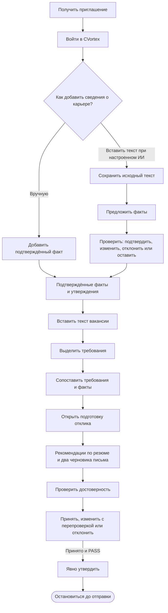
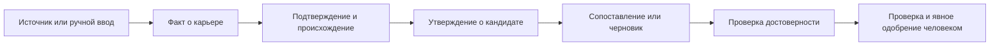
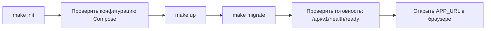
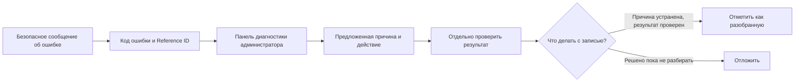

# Карта процессов CVortex

Здесь показано, как устроены действия пользователя и оператора в текущей предварительной версии. M1.1–M1.3 реализованы; реализация M1.4 находится в `stage`. Проверка Preview 0.1 с реальными пользователями и сбор отзывов ещё впереди — эта карта не означает, что проверка уже пройдена.

Для извлечения фактов, анализа вакансии и подготовки черновиков оператор должен подключить сервис ИИ. Факты о карьере можно добавлять вручную. Требования вакансии система сопоставляет с фактами по заданным правилам. Ссылка на вакансию сохраняется для справки; страницу по ней CVortex не загружает.

## Сценарий пользователя в Preview 0.1 — реализован, проверка ожидается

Пользователь может добавить факт вручную или вставить текст о карьере. Если он вставит текст, CVortex предложит факты, которые нужно проверить: подтвердить, исправить или отклонить. Затем можно вставить вакансию, посмотреть её требования и совпадения с опытом, открыть подготовку отклика и проверить черновики. Утверждение отмечает решение пользователя внутри CVortex; работодателю материалы не отправляются.

Ссылка на вакансию необязательна: CVortex её сохраняет, но не загружает страницу. Проверка достоверности отклоняет неподтверждённые сведения; после изменения текста её нужно пройти заново. Утверждённый черновик остаётся в CVortex: его нельзя скачать отдельным файлом или отправить работодателю.

## Откуда берутся сведения и чему можно доверять

Вставленный текст о карьере — исходный материал, а не проверенный факт. При ручном вводе факт сразу получает соответствующую отметку происхождения. Предложенные системой факты остаются неподтверждёнными, пока человек их не проверит. Утверждение о кандидате можно использовать при сопоставлении и в черновике, только если оно опирается на подтверждённый факт того же пользователя и связано с надёжным источником.

Связь исходного текста с фактом сохраняется для проверки. Неподтверждённые сведения не служат доказательством и не должны попадать в текст о кандидате.

## Локальный запуск

В новой копии репозитория оператор сначала подготавливает настройки, затем проверяет конфигурацию Compose, запускает службы и применяет миграции. После успешной проверки готовности можно открыть приложение.

Команды проверки и восстановления приведены в инструкции [«Локальная установка»](../10-Operations/Local-Development.md). Адрес Nginx команда получает из Compose, поэтому учитывает настроенный порт. Контейнер PostgreSQL может быть исправен, а приложение — не готово, если в существующем томе нет базы из `POSTGRES_DB`. Проверяйте настройки и содержимое тома, не удаляя его.

## Разбор ошибок

В сообщении об ошибке могут быть код и `Reference ID` — идентификатор для поиска записи о сбое. В панели диагностики администратор увидит сохранённые сведения и рекомендуемое действие. Он должен отдельно проверить результат операции, а затем отметить запись как разобранную или отложенную. Диагностика не всегда находит первопричину и не подтверждает, изменились ли данные.

Передавайте администратору код и `Reference ID`, но не пароль, ключ API и полный текст резюме или вакансии. Подробные шаги для пользователя и администратора приведены в [инструкции по разбору ошибок](Error-Center-User-Guide.md).

## Что запланировано после Preview: M2 и далее

M2 ещё не начат: сначала нужно завершить проверку Preview 0.1. В плане развития указаны пакет материалов для отклика, версии резюме, создание DOCX/PDF, защищённое скачивание и отметка «Отклик отправлен». Пока этих возможностей нет. CVortex не отправляет отклики автоматически; в будущем пользователь сможет вручную отметить, что сам отправил отклик.

Подробный состав будущих этапов приведён в [плане развития](../01-Product/Roadmap.md). Упоминание функции в плане не означает, что она уже доступна.
