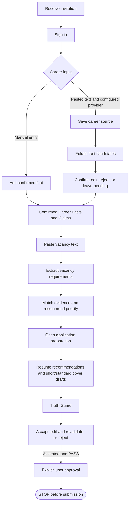
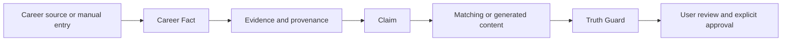
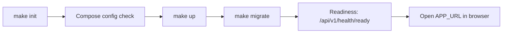
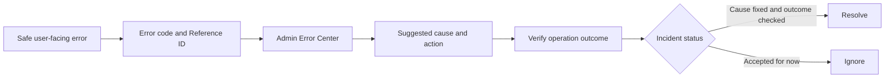

# CVortex Process Map

This page maps the product and operator paths available in the current Preview. M1.1–M1.3 are implemented; M1.4 is implemented in `stage`. Preview 0.1 still awaits recorded real-user end-to-end acceptance and feedback, so this map is not evidence that the Preview gate has passed.

The diagrams show the current implementation. Provider-backed extraction and draft generation need an operator-configured AI provider; manual Career Fact entry and deterministic matching remain available without one. Vacancy URLs are stored as metadata and are never fetched.

## Preview 0.1 user workflow — implemented, acceptance pending

Career input can be entered manually as a confirmed fact or pasted as source text. Extraction creates pending candidates; a person must confirm or edit them before they can support Claims. Vacancy analysis and draft preparation use provider-backed extraction/generation and deterministic validation. Approval is explicit and ends inside CVortex.

The optional vacancy URL is metadata only. Truth Guard blocks unsupported factual content; editing requires revalidation. Approval records user intent but does not create a document package or send anything to an employer.

## Truth and provenance

Pasted career text is treated as untrusted source material. Manual facts keep manual provenance. Extracted candidates remain pending until a person reviews them. A Claim can support matching or generated wording only while its evidence points to confirmed, same-owner Career Facts with valid provenance.

The source-to-fact relationship is preserved for review. A pending fact is not trusted evidence; only valid Claims grounded in confirmed facts can cross into candidate-facing matching or drafts.

## Local runtime

For a fresh checkout, the operator prepares local settings, validates Compose configuration, starts the services, applies migrations, checks dependency readiness, and then opens the configured application URL.

Use the readiness command and recovery steps in [Local Development](../10-Operations/Local-Development.md). The command derives Nginx's published address from Compose, so the configured port is honored. A PostgreSQL container can be healthy while application readiness fails if the configured database is absent from the existing volume; inspect the current volume configuration without removing it.

## Diagnostics

A safe user-facing error may include a stable error code and Reference ID. An administrator can search for a recorded incident, inspect its suggested cause and recommended action, verify the outcome separately, then mark it resolved or ignored. Error Center provides bounded diagnostics; it does not guarantee a root cause or confirm that application data changed.

Users should share the code and Reference ID with an administrator, not passwords, API keys or full career/vacancy text. See the [Error Center guide](Error-Center-User-Guide.md) for user and admin steps.

## Planned after Preview: M2+

M2 has not started and remains gated on Preview 0.1 real-user validation. The roadmap describes a future traceable application package with structured resume versions, DOCX/PDF generation, private downloads and a manual `Mark as applied` action. Those processes are not implemented today. CVortex does not submit applications automatically; future submission remains a user action outside the current workflow.

See the [Product Roadmap](../01-Product/Roadmap.md) for the canonical planned scope. Do not treat roadmap items as available product behavior.
