# Phase 06 Product Design

## PRD

CVortex is a personal Job Search OS for a person who needs to turn fragmented career material and vacancy context into truthful, relevant, reviewable application packages. It prevents repeated manual reconstruction and employer-specific contradictions; it does not apply or communicate on the user's behalf.

Primary user: an invited job seeker. Admin manages invitations and explicitly authorised administrative operations, never receives blanket access to private career data. Core jobs: establish a confirmed Career Fact Base; decide whether to pursue a vacancy; prepare and approve a truthful package; preserve employer context; prepare for interviews; learn from outcomes.

Success means a user can explain any recommendation and candidate-facing statement back to confirmed evidence, see the exact approved materials for an application, and resolve a contradiction before sending it. Dependencies are confirmed facts, user approval, the API boundary, controlled source ingestion and the deterministic document pipeline. Main risks are incomplete facts, misleading external input, overconfident AI output, privacy leakage and document-rendering variance.

## Verifiable requirements

| ID | Requirement |
|---|---|
| FR-001 | An invited user can create and maintain a Career Fact Base; AI-proposed facts remain `PENDING` until that user confirms or rejects them. |
| FR-002 | A user can add a vacancy from an allowed source mode and retain an immutable raw snapshot. |
| FR-003 | The system produces explainable vacancy analysis and a priority recommendation from confirmed facts and normalized requirements. |
| FR-004 | A user can approve, edit or reject resume and cover-letter recommendations before an application becomes `READY_TO_APPLY`. |
| FR-005 | The user records manual application confirmation, status history, conversations, interviews and outcome. |
| FR-006 | Employer Memory participates in new employer-facing generation and blocks confirmed contradictions pending resolution. |
| NFR-001 | All product invariants execute at the shared backend API boundary; slow imports, generation and rendering are asynchronous. |
| NFR-002 | The local MVP is operable on a Mac through Docker Compose and portable to a conventional VPS/container host. |
| SEC-001 | Server-side ownership checks prevent direct, nested, enumerated, queued, file and LLM-context cross-user access. |
| SEC-002 | External text, files and web responses are untrusted data; unsafe rendering, unrestricted fetch and unrestricted tools are prohibited. |
| AI-001 | Domain workflows use provider-independent contracts and logical model policies, not permanent model identifiers. |
| AI-002 | Candidate-facing content fails closed when Claim-to-confirmed-Fact provenance is absent or contradictory. |
| DATA-001 | Provenance and audit are distinct, queryable records; durable business truth is in PostgreSQL. |
| PRIV-001 | Context, logs, exports and retention minimise PII; credentials are encrypted, masked and never logged. |
| OPS-001 | Background work is idempotency-aware, observable and records safe run/accounting metadata. |
| UX-001 | Review states explain evidence, changes, blockers and required user resolution without pretending certainty. |

## User flows

```mermaid
flowchart LR
  O[Invite and onboarding] --> C[Career Fact Base]
  C --> I[Import resume] --> P[PENDING facts] --> R[Review] --> F[CONFIRMED facts]
  V[Add vacancy] --> A[Analysis and should-I-apply]
  F --> A --> RR[Resume recommendations] --> H[Approve, edit or reject]
  H --> CL[Cover letter] --> AP[Prepare application] --> M[Manual application confirmation]
  M --> T[Tracking] --> EM[Employer Memory] --> IN[Interview preparation/history] --> OUT[Outcome]
  EM -. employer context .-> RR
```

The flow deliberately routes imported resumes and recruiter conversations through review: extraction can propose data, never certify it. Application confirmation is manual. Conversation import updates Employer Memory only as untrusted source material or user-confirmed facts.

## Scope and roadmap

**MVP:** invite-only accounts; Career Fact Base and review; controlled vacancy input and analysis; explainable matching; versioned resume/cover package; Truth Guard; manual application tracking; employer context; basic interview and outcome history; local-first web/PWA.

**Post-MVP:** additional approved source adapters, richer analytics, browser/mobile clients, deeper research automation and measured semantic-search improvements.

**Explicitly out of scope:** automatic submissions or employer messages, fabricated/AI-detector-evasion content, native mobile, Kubernetes, microservices, Kafka, standalone vector DB, GraphQL, fine-tuning and event sourcing.

`Foundation → Infrastructure → Auth → Career Foundation → Vacancies → Matching → Application Package → Employer Memory → Interview → Analytics/later capabilities`.
