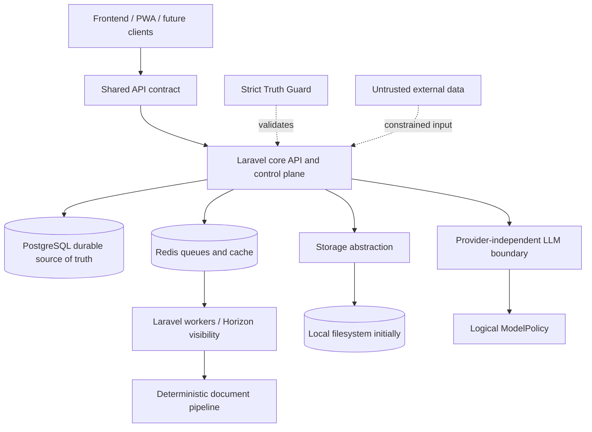

# Phase 05 Architecture Baseline

## Purpose and authority

This document is the compact map of the architecture frozen in Phase 05. The individual accepted ADRs are authoritative for decision details, alternatives and consequences; the [Architecture Decision Index](../03-ADR/INDEX.md) is the canonical inventory.

If this summary conflicts with an accepted ADR, the ADR wins. If evidence later challenges an accepted ADR, retain the old record and create an explicit amending or superseding ADR.

## System baseline

The baseline is a modular Laravel application in an incremental monorepo, backed by PostgreSQL and Redis, deployed locally through Docker Compose first with Nginx as the approved web entry point, and portable to a conventional VPS/cloud host. Heavy operations leave interactive HTTP through Laravel queues; Horizon provides visibility. No Kubernetes, Kafka, microservice split, event sourcing, GraphQL or standalone vector database is accepted.

## Cross-cutting invariants

1. **Truth and provenance:** `CONFIRMED Career Fact → Claim → Generated Content`. AI-proposed facts remain `PENDING`; only a human can confirm them. Confirmed employer contradictions block until explicit resolution.
2. **Human control:** important generated changes and employer-facing actions require user approval. Automatic application submission remains outside the boundary.
3. **Multi-user isolation:** private resources have ownership; server authorization derives identity from authenticated context and never trusts client `user_id`.
4. **Untrusted input:** vacancies, recruiter messages, websites and uploaded documents are data, never instructions. Context, network, file and tool access are least-privileged.
5. **API-first:** clients share the backend contract; business rules do not exist only in frontend code.
6. **Deterministic before AI:** schemas, rules, state transitions and validators enforce what can be enforced deterministically.
7. **Provider independence:** Provider, ModelPolicy, Skill, Agent, Workflow, Tool, Prompt and ContextBuilder remain separate. Provider/model mapping is mutable configuration.
8. **Documentation and design:** Git Markdown is the durable knowledge source and Obsidian is an interface. Figma is the reviewed visual authority; Git-held DTCG tokens are the sole machine-readable token authority.

## Architectural boundaries accepted for Phase 06

- invitation, authentication, authorization, role and ownership are distinct concerns;
- PostgreSQL owns durable domain state; Redis is queue/cache infrastructure, not business truth;
- file identity/metadata is separate from binary storage, with a local adapter first;
- document semantics are structured and provenance-aware; deterministic templates create DOCX, LibreOffice converts to PDF, and outputs are validated;
- external-source modes are capability/policy gated rather than one generic scraper;
- concrete dependency versions, provider catalogs, model names, prices and tuning presets are not permanent architecture facts.

## Conflicts reviewed and resolved

| Conflict | Resolution and priority |
|---|---|
| `.agents/state/BLOCKERS.md` said Phase 03 was missing, while current `STATUS.md`, commit state and `research/technical/**` show it completed and reconciled. | Treat the blocker as stale state. Current verified repository state wins; Phase 05 proceeds and `BLOCKERS.md` is corrected. |
| `research/technical/DECISION-CANDIDATES.md` labels OpenAI as the owner-fixed first provider, while `PROJECT.md` says the first implementation *may* be OpenAI and concrete providers remain configuration/research concerns. | `PROJECT.md` has higher source-of-truth priority. OpenAI remains an allowed first adapter, not an immutable owner constraint. Research is preserved unchanged as dated evidence. |
| `research/PHASE-04-SUMMARY.md` records the then-current missing-Phase-03 blocker. | Preserve it as historical research context; later verified state explicitly reconciles the sequence. No research history is rewritten. |
| `research/RESEARCH-INDEX.md` repeated the obsolete blocker as current navigation state. | Update only the index status/navigation to the reconciled sequence and Phase 06 readiness; preserve all underlying research artifacts and conclusions. |

No accepted ADR existed before Phase 05, so no accepted decision required supersession.

## Deferred, not blocking Phase 06

- final ERD/table design and API endpoint/OpenAPI contracts;
- exact auth packages, invitation endpoints and authorization mechanics;
- runtime/product LLM Skill canonical location and lifecycle (must not be `.agents/`);
- concrete provider adapters, model mappings, prices and routing thresholds;
- dependency/runtime version pins and compatibility validation;
- exact queue topology, supervisors and retry parameters;
- component primitive library;
- token transformer/synchronization tooling and file location;
- document generation library and LibreOffice build after fidelity tests;
- detailed threat model, source retention rules and ingestion adapter contracts;
- future semantic-search implementation and any need for specialized storage.

These are intentionally Phase 06 or later decisions. None prevents starting `06-product-data-ai-security-design` inside this baseline.

## Freeze rule

From Phase 05 onward, an accepted ADR is the authoritative source for its architecture boundary. Changing it requires an explicit versioned decision. An unfrozen implementation detail remains reversible and must not be smuggled into architecture by habit, framework default or vendor brochure hypnosis.
