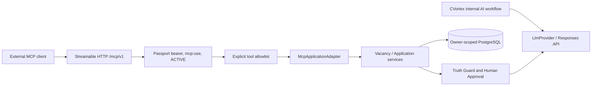

# MCP Gateway v1

## Boundary

The MCP adapter is an additional inbound access channel. It never serves arbitrary REST routes. The outbound `OpenAiResponsesProvider`, ModelPolicy, runtime Skills and `OPENAI_API_KEY` remain unchanged. The existing application Truth Guard still uses `LlmProvider` for semantic review; with `AI_PROVIDER=none` or an unavailable API it fails closed with `VALIDATION_UNAVAILABLE`. The deterministic provenance/claim checks remain inside CVortex services. No Employer Memory or EmployerConsistencyCheck exists in the current M1.4 domain, so no employer memory is returned and no employer conflict check is claimed. This does not start M2 or M4.

## Authentication and deployment

`MCP_ENABLED=false` is the default. When enabled, `/mcp/v1` and OAuth discovery/registration routes become available through the existing loopback-bound Nginx. `/mcp/v1` requires a Bearer token with `mcp:use`; browser cookies cannot authenticate to it. Passport authorization uses the existing CVortex web login/session and a local explicit consent form. OAuth client registration currently allows the documented callback-ID-specific ChatGPT path; the stable callback path requires a separate issuer/OAuth connection review. Registration/discovery has an IP rate limit, while authenticated reads and writes have separate per-user limits. Disabling a user revokes their OAuth access and refresh tokens. Passport keys must be generated once in ignored private storage and kept out of Git/logs.

The local Inspector path is validated. ChatGPT E2E is **not** validated: account/workspace entitlement, external reachability and OAuth `resource` audience propagation/verification remain open. A tunnel does not itself expose the OAuth authorization server. A public connection needs HTTPS, secure cookies, a reachable authorization endpoint, audience binding and renewed security review. Do not infer API-credit or tunnel pricing from a Plus subscription.

## Tool allowlist and contract

All tools require the same authenticated principal and `mcp:use`; `user_id` is never an argument. All IDs are ULIDs. Tool descriptions and vacancy fields label external content as untrusted. Top-level input and output JSON schemas reject additional properties; nested context objects and claim usages are likewise bounded. Contract-breaking changes require a new tool name or MCP endpoint version.

| Tool | Class / side effect | Input | Output | Errors / approval |
|---|---|---|---|---|
| `vacancy_get` | read; one owned vacancy | `vacancy_id` | ID, title, company, analysis status, untrusted flag | `NOT_FOUND`, `VALIDATION_FAILED`; no approval |
| `application_context_get` | read; current analyzed snapshot only | `vacancy_id` | normalized requirements plus only relevant PASS claims backed by CONFIRMED Career Facts; no source excerpts | `NOT_FOUND`, `VALIDATION_FAILED`; no approval |
| `application_draft_submit` | one reversible cover draft; no send | `vacancy_id`, `SHORT`/`STANDARD`, content ≤6000 chars, ≤30 assertion-to-Claim mappings | draft/preparation IDs, `PASS`, `PENDING_REVIEW`, approval required | `TRUTH_GUARD_BLOCKED`, `VALIDATION_UNAVAILABLE`, `VALIDATION_FAILED`, `NOT_FOUND`; explicit CVortex approval remains necessary |

`PENDING_REVIEW` is an MCP response label for the existing persisted `application_draft_items.status = DRAFT`; it does not introduce a database state. The write route rejects duplicate variants and a stale or already approved preparation. A passing draft receives a revision and owner-scoped provenance. The tool set has no accept/approve/fact-confirm/apply/email/recruiter-message operation. Client UI confirmation is supplementary and cannot replace CVortex approval.

The HTTP layer returns 401 for missing/invalid bearer tokens, 403 for missing scope or disabled user, and 429 when rate limited. Tool-level errors use `isError=true` and a stable code; internal exception text, SQL and stack traces are suppressed. Logs keep request ID, user ID, known method/tool name, safe result code, HTTP status and latency only; they omit arguments, content, tokens and private career data. A forged `user_id` argument fails schema validation and never changes the authenticated principal.

## Data exposure

| Class | Examples | MCP policy |
|---|---|---|
| SAFE_METADATA | tool names and descriptions | exposed on authenticated discovery |
| USER_PRIVATE | one owned vacancy title/company, normalized requirements | exposed only for selected ID |
| SENSITIVE_PRIVATE | relevant confirmed Career assertions and Claim IDs | exposed only by context tool after current analysis and owner checks |
| SECRET | API keys, OAuth/session tokens, password hashes, internal credentials | never exposed |

No raw vacancy body, source excerpt, unrelated career history, all vacancies, recruiter conversations, documents, arbitrary SQL, URL fetch, shell, filesystem or generic service proxy is exposed. Nginx remains loopback-bound by default. PostgreSQL owner context and owner filters both apply; HTTP auth is evaluated before domain access.

## Verification boundary

See [research](../../research/technical/11-MCP-GATEWAY-FOUNDATION.md) for plan/billing gates, [local operations](../10-Operations/Local-Development.md) for activation and [validation evidence](../10-Operations/MCP-Gateway-Validation.md) for exact local results. Inspector success proves protocol and local bearer auth only; it is not a ChatGPT connection pass. Tests exercise own/foreign resources, invalid credentials, scope, Truth Guard block, approval absence and revocation. External account/tunnel/OAuth flow must be tested separately before claiming ChatGPT readiness.
