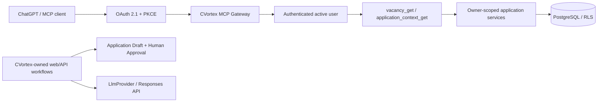

# CVortex MCP Gateway

## Product boundary

The inbound MCP gateway is **read-only**. Its surface contains exactly two tools:

1. `vacancy_get`
2. `application_context_get`

An external MCP client can read bounded context for the authenticated CVortex user. It cannot create or change product data. Draft preparation, Truth Guard, Human Approval, Career Fact review and application workflows remain available through CVortex-owned web/API paths.

```mermaid
flowchart LR
    Client[ChatGPT / MCP client] --> OAuth[OAuth 2.1 + PKCE]
    OAuth --> Gateway[CVortex MCP Gateway]
    Gateway --> Auth[Authenticated active user]
    Auth --> Tools[vacancy_get / application_context_get]
    Tools --> Adapter[Owner-scoped application services]
    Adapter --> RLS[(PostgreSQL / RLS)]
    CV[CVortex-owned web/API workflows] --> Draft[Application Draft + Human Approval]
    CV --> LLM[LlmProvider / Responses API]
```

Inbound MCP and outbound model execution remain separate. The existing `LlmProvider`, `OpenAiResponsesProvider`, ModelPolicy, runtime Skills and `OPENAI_API_KEY` path are unchanged. Neither MCP initialization nor either read tool calls an LLM provider.

## Authentication and deployment

`MCP_ENABLED=false` is the default. When enabled, `/mcp/v1` uses Streamable HTTP and Passport OAuth bearer tokens with `mcp:use`. The server derives the owner from the validated active user; caller-supplied identity never authorizes access. PostgreSQL owner context and owner-scoped queries both apply. Browser cookies do not authenticate MCP requests.

The authorization server requires the exact canonical OAuth `resource` on authorization and token requests, places that resource in the issued access token and checks it again on MCP requests. The access token issuer must match the configured authorization-server issuer. OAuth metadata advertises issuer response support; successful and error authorization redirects include the issuer when the callback passes the same strict URI policy. DCR accepts the documented ChatGPT stable and callback-ID redirect forms plus exact native loopback callbacks with dynamic ports. It rejects host confusion, userinfo, path traversal, encoded paths, query/fragment and malformed URIs.

The protected-resource challenge URL is derived from the canonical `MCP_RESOURCE_URL`, not the inbound Host or forwarded-proto headers. For a private-server tunnel, configure that URL to the externally advertised MCP resource; configure `MCP_AUTHORIZATION_SERVER_URL` to the reachable OAuth issuer separately.

The local stack binds Nginx to loopback. Public exposure is not enabled by this feature. A Secure MCP Tunnel remains the preferred remote path when account/workspace permissions and the OAuth metadata/resource mapping are verified. OpenAI documents MCP traffic and OAuth discovery through the tunnel; the tunnel does not provision or automatically tunnel the authorization server, whose issuer, authorization and token endpoints must remain reachable for the OAuth flow. See [current product research](../../research/technical/11-MCP-GATEWAY-FOUNDATION.md) and [validation evidence](../10-Operations/MCP-Gateway-Validation.md).

## Tool contract

Every tool requires the same authenticated principal and `mcp:use`; both accept only one ULID vacancy ID. Schemas reject additional properties. Vacancy text is untrusted data, never server instructions.

| Tool | Effect | Input | Bounded output | Access and errors |
|---|---|---|---|---|
| `vacancy_get` | Read only | `vacancy_id` | ID, title, company, persisted analysis status, untrusted-data marker | One owned vacancy; `NOT_FOUND` for missing or foreign IDs |
| `application_context_get` | Read only | `vacancy_id` | Vacancy metadata/status; at most 50 requirements, 25 relevant confirmed claims, and 20 confirmed facts per claim; `context_truncated` indicates clipping | Same owner checks; no raw vacancy body, source excerpt, secrets or unrelated career records |

If analysis is pending, failed or otherwise not completed, the context tool returns bounded vacancy metadata, empty derived requirements/claims, and `untrusted_vacancy_data=true`. A completed analysis is selected for the current career signature; only relevant passing claims backed by confirmed Career Facts are returned. Missing/stale derived analysis fails safely rather than broadening access.

No MCP capability can create or modify drafts, approve content, confirm/reject/update Career Facts, change application state, send an application or recruiter message, update vacancies, fetch arbitrary URLs, access files, invoke SQL/shell, read environment/secrets or act as a generic service proxy. MCP requests do not enqueue product jobs or write product rows.

## Errors, logs and limits

Missing/invalid bearer tokens receive a safe 401 response and protected-resource challenge. Missing scope or inactive accounts are denied. Cross-owner resources are non-enumerating `NOT_FOUND`. Tool errors use stable codes; unexpected failures return a request ID and generic error without exception text, SQL or stack trace. Safe auth/error log entries exclude bearer/refresh tokens, secrets, prompt content and private career data. `APP_DEBUG=false` is required in production; local framework logs can include additional exception detail outside the MCP response boundary.

Discovery and authenticated reads are rate-limited. The MCP request path has no write rate bucket because there are no MCP write operations. See [local operations](../10-Operations/Local-Development.md) and [MCP validation](../10-Operations/MCP-Gateway-Validation.md) for tested results and the exact local environment contract.
