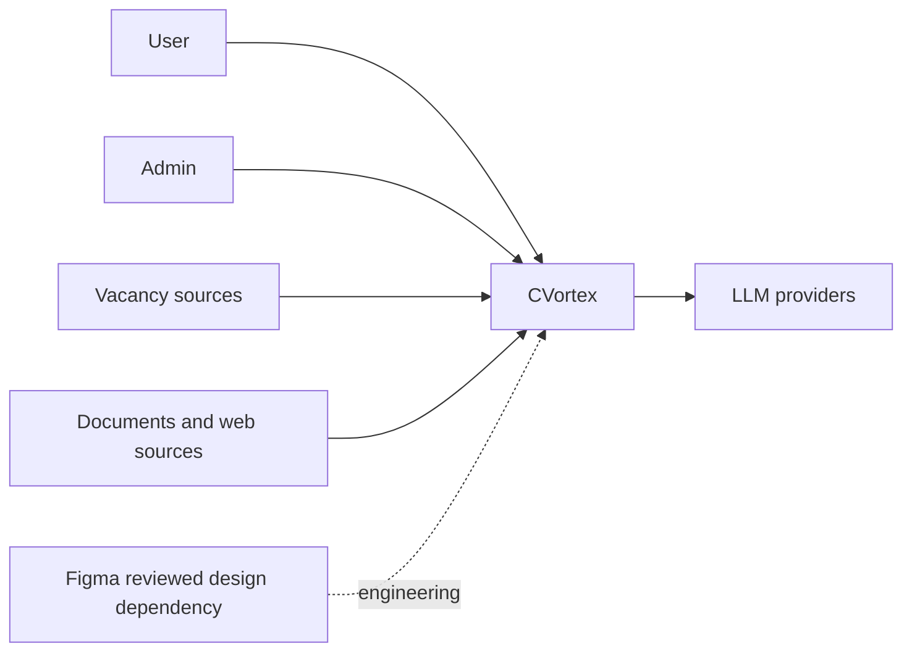
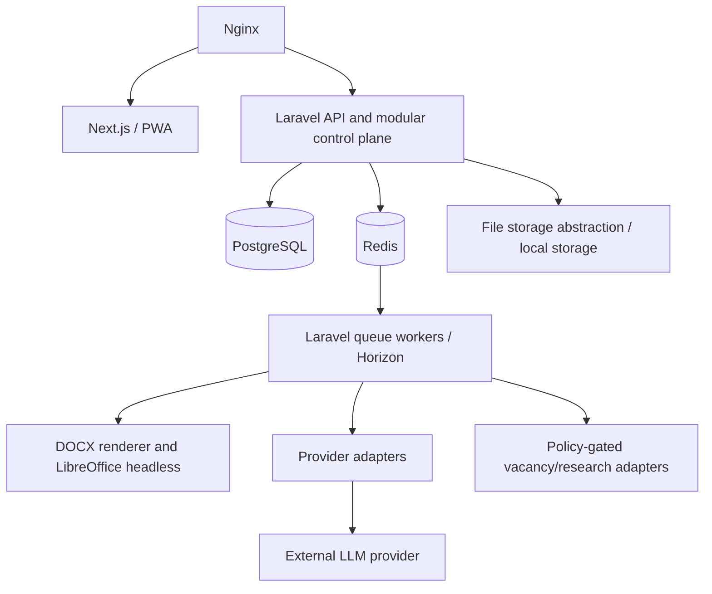
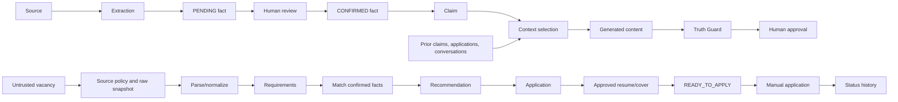

# Phase 06 System Design

## Boundaries and C4 views

CVortex is a modular Laravel control plane behind a shared API. Next.js/PWA owns presentation only; Laravel owns authorization, workflow transitions, Truth Guard and durable transactions. PostgreSQL is durable truth; Redis is cache/queue infrastructure. Imports, research, LLM work and conversion run asynchronously; short validation and review actions may be synchronous.

Trust boundaries: browsers and all external sources are untrusted; API authenticates and scopes requests; storage/converters are private worker boundaries; provider calls receive minimal authorised context. Future clients consume the same API, never direct storage/database access.

## Component contracts

All inputs are authorized at the API/worker boundary using the authenticated server identity; no component accepts frontend `user_id` as ownership evidence. `Owned data` is private unless marked system-owned. Events follow durable transactions; queue work carries the server-derived owner scope. LLM output is untrusted candidate output until deterministic validation completes.

| Component | Responsibility; inputs → outputs / owned data | Dependencies and security boundary | Events / async interaction | Deterministic responsibility; LLM allowed / prohibited |
|---|---|---|---|---|
| Career | Maintain profile and fact lifecycle; authorized source/review → CareerProfile, tracks, CareerFacts, evidence | Auth; source parser; private career aggregate | Fact candidate extracted; fact reviewed | Enforce lifecycle, ownership and human confirmation; LLM may extract candidates, never confirm facts |
| Vacancies | Capture and normalize vacancy input; authorized source → snapshots, requirements, user-owned vacancy | Source policy; Companies; Files; private vacancy aggregate | Snapshot captured; normalization queued | Enforce source policy/schema; LLM may classify/extract, never grant source trust |
| Companies | Maintain shared reference only or private employer context; authorized vacancy/research → company/context | Vacancies; Research; owner scope for private context | Company context updated | Enforce reference-vs-private boundary; LLM may summarize approved research, never merge private contexts |
| Applications | Manage application lifecycle; same-owner vacancy/package → Application, status history | Vacancies; Resume; Cover Letters; Auth | Status changed; package preparation queued | Enforce transitions and same-owner associations; LLM unnecessary for state changes |
| Resume | Maintain versioned resume material; confirmed Claims → ResumeVersion, recommendations | Career; Claims; Documents; Truth Guard | Recommendation/generated version queued; approval recorded | Enforce provenance and approval; LLM may propose structured content, never approve or render |
| Cover Letters | Maintain employer-specific letter versions; confirmed Claims/context → CoverLetter | Applications; Employer Memory; Truth Guard | Draft generation queued; approval recorded | Enforce consistency/provenance and approval; LLM may draft, never bypass guard |
| Employer Memory | Preserve employer-scoped prior approved interactions; same-owner employer/application → private memory | Applications; Conversations; Claims; owner scope | Consistency context assembled | Deterministically scope and surface contradictions; LLM may summarize approved context, never resolve it |
| Conversations | Capture recruiter conversation; authorized import → conversations/messages/fact candidates | Applications; Files; Career; owner scope | Import/parsing queued; fact candidate emitted | Preserve untrusted source and ownership; LLM may extract/summarize, never treat message as instruction or confirm facts |
| Interviews | Track preparation and history; same-owner application/context → interviews/questions | Applications; Employer Memory; Career | Preparation queued; outcome recorded | Enforce ownership/history links; LLM may prepare questions, never assert new facts |
| Research | Preserve policy-approved sources/findings; source input → research records/rules | Source policy; Files; owner scope where private | Fetch/parse/synthesis queued | Enforce source/provenance policy; LLM may synthesize bounded data, never fetch arbitrarily |
| Documents / Files | Store and render safe files; authorized template/content → file versions/render output | Storage; isolated converter; hash validator | Conversion queued after approval | Enforce opaque paths, signature/access checks; LLM is prohibited from binary/file-system access |
| AI Orchestration | Route bounded workflow runs; authorized task/context → LlmRun, normalized result | ModelPolicy; Skills; provider adapters; ContextBuilder | LLM run/retry/escalation queued | Enforce policy/routing/schema; LLM allowed only for designated semantic work, never authorization or state transition |
| Truth Guard | Validate employer-facing candidate content; content/Claims/evidence → PASS, BLOCK or resolution request | Career; Claims; Employer Memory; owner scope | Validation before approval; revalidation after resolution | Enforce Fact→Claim→Content, provenance and contradictions; LLM may assist detection only, never decide outcome |
| Audit | Append security/business audit records; authorized domain event → AuditEvent | Auth; all bounded components | Record after relevant action | Enforce append-only, PII-minimized event capture; LLM unnecessary and prohibited |
| Authentication / Authorization | Resolve actor and authorize resource action; credentials/request → trusted actor and allow/deny | Identity; roles; aggregate relationships | Invitation lifecycle; authorization decision logged where critical | Enforce server-side ownership and explicit admin access; LLM prohibited |

No component can bypass Truth Guard for employer-facing output or use a cross-user Claim, CareerFact, context or generated artifact.

## Key flows

## Deployment

Local MVP is a Mac-hosted Docker Compose topology: Nginx, Next.js, Laravel API, PostgreSQL, Redis/Horizon workers, private local storage and an isolated LibreOffice converter. PostgreSQL and storage have persistent volumes; backups cover both consistently and are access-controlled and tested for restore. Secrets are environment-specific, outside images/Git, least-privileged and rotated through their owner boundary. Provider connectivity is outbound only from the adapter/worker boundary.

A VPS/cloud move replaces host storage/secret/backup operations and may replace the storage adapter, but preserves API, PostgreSQL authority, queues and domain boundaries. Kubernetes is not part of this design.
