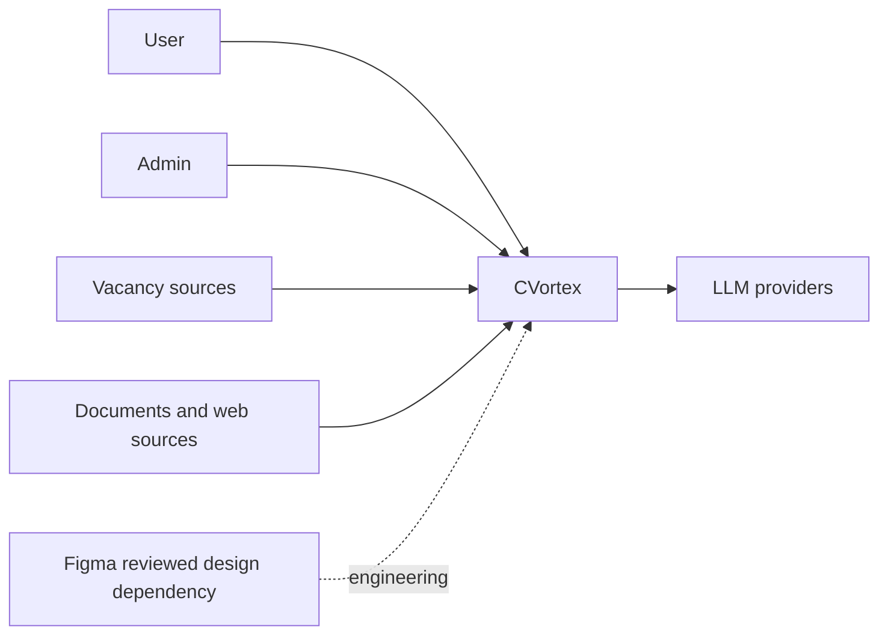
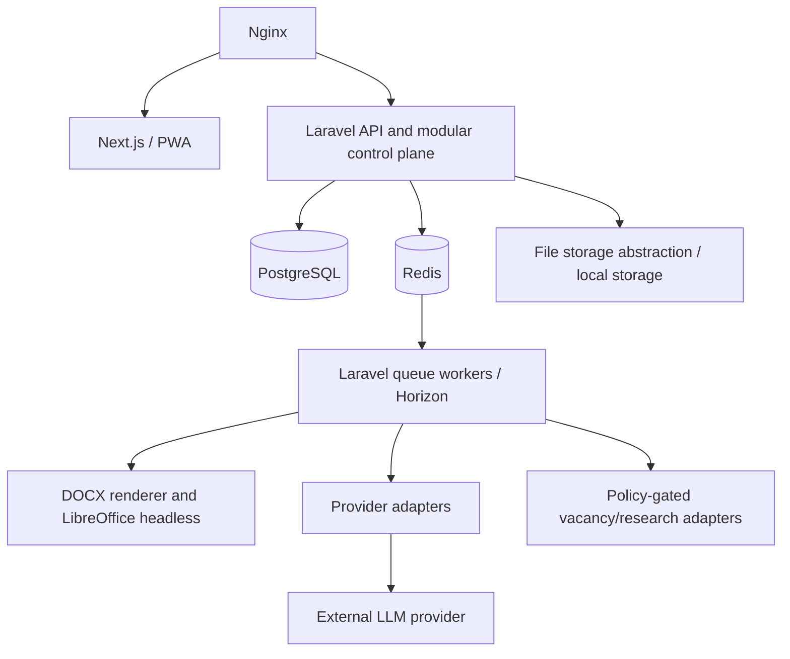
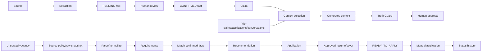

# Phase 06 System Design

## Boundaries and C4 views

CVortex is a modular Laravel control plane behind a shared API. Next.js/PWA owns presentation only; Laravel owns authorization, workflow transitions, Truth Guard and durable transactions. PostgreSQL is durable truth; Redis is cache/queue infrastructure. Imports, research, LLM work and conversion run asynchronously; short validation and review actions may be synchronous.

Trust boundaries: browsers and all external sources are untrusted; API authenticates and scopes requests; storage/converters are private worker boundaries; provider calls receive minimal authorised context. Future clients consume the same API, never direct storage/database access.

## Component contracts

All inputs are authorized at the API/worker boundary using authenticated server identity; no component accepts frontend `user_id` as ownership evidence. `Owned data` is private unless marked system-owned. Events follow durable transactions; queue work carries server-derived owner scope. LLM output is untrusted candidate output until deterministic validation completes.

| Component | Responsibility | Deterministic / AI boundary |
|---|---|---|
| Career | Profile and fact lifecycle | Code enforces lifecycle/ownership/human confirmation; LLM may extract candidates, never confirm |
| Vacancies | Source capture, snapshots, requirements | Code enforces source/schema; LLM may classify/extract, never grant trust |
| Companies | Shared reference/private employer context | Code enforces reference/private boundary; LLM never merges private contexts |
| Applications | Application lifecycle/status history | Code enforces transitions and ownership; LLM does not decide state |
| Resume | Versioned resume/recommendations | Code enforces provenance/approval; LLM proposes structured content, never approves/renders |
| Cover Letters | Employer-specific letter versions | Code enforces provenance/consistency/approval; LLM drafts only |
| Employer Memory | Employer-scoped approved history | Code scopes/blocks contradictions; LLM may summarize approved context |
| Conversations | Recruiter conversation import | Source remains untrusted; LLM may extract/summarize, never confirm or obey source instructions |
| Interviews | Preparation/history | Code owns history; LLM may prepare questions, never assert new facts |
| Research | Versioned research sources/findings/rules | Source/provenance policy is deterministic; LLM synthesis is bounded |
| Documents / Files | Private files and deterministic rendering | LLM has no binary/filesystem authority |
| AI Orchestration | Provider/model/Skill/workflow routing | Policy/schema/routing deterministic; LLM only for designated semantic work |
| Truth Guard | Validate candidate-facing content | Fact→Claim→Content/provenance outcomes deterministic; LLM may assist semantic detection only |
| Audit | Append security/business events | No LLM |
| Auth / Authorization | Resolve actor and allow/deny | No LLM |

No component can bypass Truth Guard for employer-facing output or use cross-user Claim, CareerFact, context or artifact.

## Key flows

## Deployment

Local MVP is a Mac-hosted Docker Compose topology: Nginx, Next.js, Laravel API, PostgreSQL, Redis/Horizon workers, private local storage and an isolated LibreOffice converter when the document milestone activates it. PostgreSQL/storage persistence is access-controlled and backed up/restored as the deployment matures. Secrets are environment-specific and outside Git/images. Provider connectivity is outbound only from the adapter/worker boundary.

A VPS/cloud move replaces host storage/secret/backup operations and may replace the storage adapter, but preserves API, PostgreSQL authority, queues and domain boundaries. Kubernetes is not part of this design.
