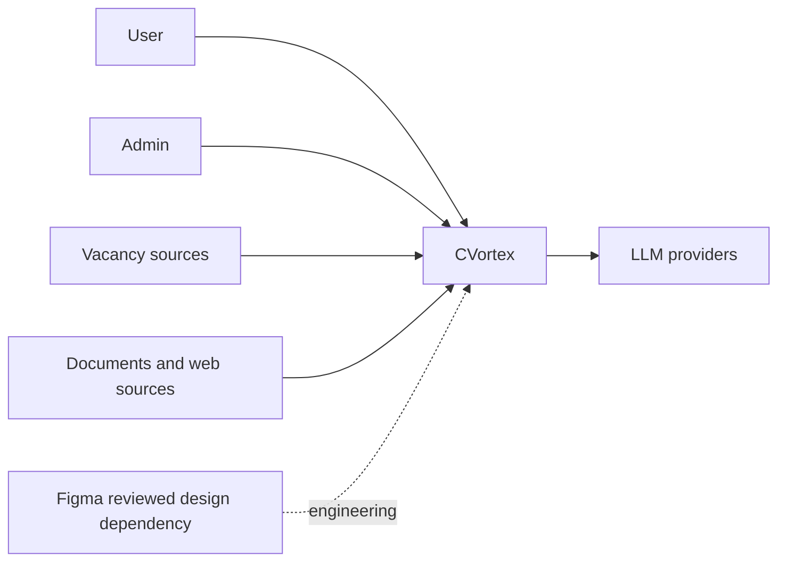
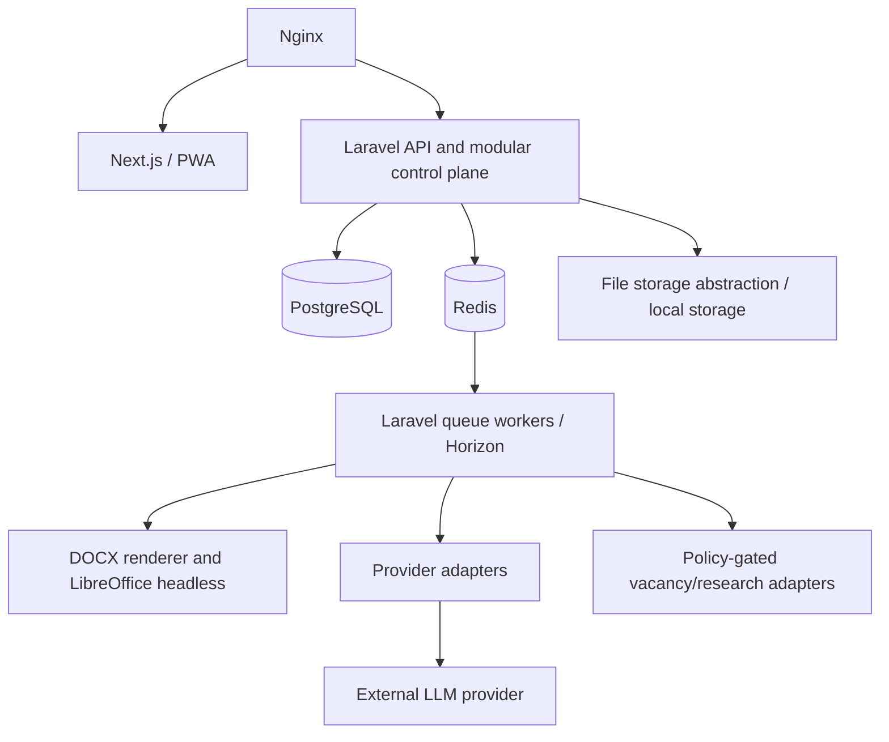
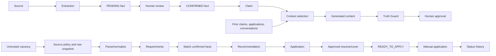

# Phase 06 System Design

## Boundaries and C4 views

CVortex is a modular Laravel control plane behind a shared API. Next.js/PWA owns presentation only; Laravel owns authorization, workflow transitions, Truth Guard and durable transactions. PostgreSQL is durable truth; Redis is cache/queue infrastructure. Imports, research, LLM work and conversion run asynchronously; short validation and review actions may be synchronous.

Trust boundaries: browsers and all external sources are untrusted; API authenticates and scopes requests; storage/converters are private worker boundaries; provider calls receive minimal authorised context. Future clients consume the same API, never direct storage/database access.

## Component contracts

| Component | Owns / outputs | Deterministic responsibility | Permitted LLM role / dependencies |
|---|---|---|---|
| Career | profiles, tracks, facts, achievements | lifecycle, confirmation, ownership | extract candidates only; source parser |
| Vacancies / Companies | snapshots, requirements, company context | source policy, normalization schema | semantic extraction/classification |
| Applications / Resume / Cover Letters | package state, versions, recommendations | state transitions, approval, provenance links | structured recommendations/content |
| Employer Memory / Conversations / Interviews | employer-scoped history | consistency lookup and blocking | summarize/prepare with approved context |
| Research | sources, findings, rules | source policy and provenance | bounded synthesis |
| Documents / Files | file identity, templates, render outputs | paths, hashes, rendering, access | never binary generation |
| AI Orchestration / Truth Guard | runs, policies, validations | routing gates, schemas, Fact→Claim→Content | semantic conflict detection only |
| Auth / Audit | invitation/access and append audit events | identity, authorization, event capture | none |

Each component receives server-derived owner scope, emits domain events or queued work after durable state, and records no secrets. No component can bypass Truth Guard for employer-facing output.

## Key flows

## Deployment

Local MVP is a Mac-hosted Docker Compose topology: Nginx, Next.js, Laravel API, PostgreSQL, Redis/Horizon workers, private local storage and an isolated LibreOffice converter. PostgreSQL and storage have persistent volumes; backups cover both consistently and are access-controlled and tested for restore. Secrets are environment-specific, outside images/Git, least-privileged and rotated through their owner boundary. Provider connectivity is outbound only from the adapter/worker boundary.

A VPS/cloud move replaces host storage/secret/backup operations and may replace the storage adapter, but preserves API, PostgreSQL authority, queues and domain boundaries. Kubernetes is not part of this design.
