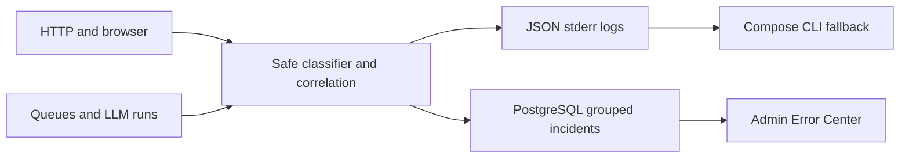

# ADR-0022 — Local structured diagnostics and grouped incidents

## Context

CVortex already emits backend logs to container stderr, supplies HTTP request IDs, stores LLM-run metadata and uses Horizon for queue visibility. None of these provides an authorized, queryable incident lifecycle.

## Decision

Keep bounded structured raw logs in container stdout/stderr, independently of PostgreSQL. Persist only grouped operational errors and recent occurrences in PostgreSQL. Fingerprints use stable code, component, exception class and operation; they exclude raw exception messages. Increment the count for every error and retain approximately the latest thousand occurrences per fingerprint. Scheduled cleanup removes expired occurrences and old closed incidents; open incidents survive cleanup. Administrative API and UI expose sanitized metadata only. Raw logs may retain a throw site plus up to eleven caller frames (basename, line, class or function only; no arguments, absolute paths or exception messages). A failed log sink or incident store cannot replace the primary application failure. Horizon remains the queue execution view; it is not exposed publicly.

The backend keeps accepted `/api/v1` and owner-derived identity boundaries. This ADR adds no external observability service or tracing substrate.

## Consequences

The Error Center can search recent request, job, LLM and application IDs and show counts, but the bounded occurrences are not an exhaustive event archive. Incident metadata includes category-derived retryability, impact and a recovery action. If PostgreSQL is unavailable, stderr is the incident source until recovery. Docker log rotation bounds local raw logs; operators must export logs separately if longer retention is required. Browser telemetry accepts only a fixed event kind and a finite server-validated component allowlist (`browser`, `app-root`, `global-root`), and derives user identity from the session. This bounds browser-created fingerprint combinations while preserving open incidents under the lifecycle retention rule. Provider retryability is classified by failure category; an HTTP 503 alone does not make an operation retryable. Queue jobs stop immediately for terminal provider categories and back off only for explicitly retryable categories, honoring a bounded provider `Retry-After` when supplied. First-party throttling responses use the `RATE_LIMITED` code; provider HTTP 429 failures use `LLM_PROVIDER_RATE_LIMITED` with the same explicit retryability and `Retry-After` behavior. Invalid generated application output is reported as an incident correlated to its preparation and LLM run. Uncaught CLI and scheduled-command failures, caught operator-command failures, and unexpected MCP tool failures are captured without replacing their primary outcome. In the Error Center, throw sites and application frames appear first; framework frames remain behind an explicit expansion.

## Alternatives

ELK/Loki/Sentry and storing every log line in PostgreSQL were rejected for this local-first slice due to operational and privacy cost. A separate correlation ID was rejected because existing request/job/LLM/application IDs cover the required links.
