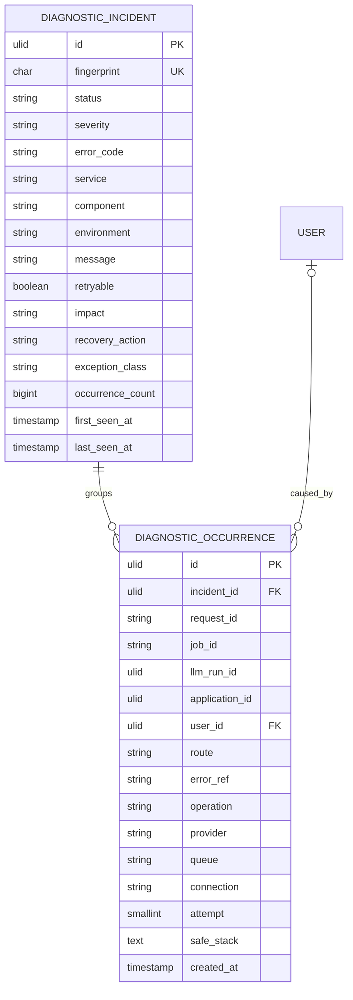

# Diagnostics data model

`fingerprint` is SHA-256 of stable error code, component, exception class and operation. `occurrence_count` counts every occurrence, including those pruned from the bounded detail history. Approximately the latest thousand occurrences per fingerprint retain searchable references. `status` is `OPEN`, `RESOLVED` or `IGNORED`; recurrence reopens `RESOLVED` and an ignored incident remains ignored. `retryable`, `impact` and `recovery_action` come from the stable error category, not the exception text. `safe_stack` is bounded to the throw site plus at most eleven caller frames, with application frames first; the UI keeps framework frames collapsed. `request_id`, `job_id`, `llm_run_id` and `application_id` are optional correlation references rather than cross-domain foreign keys: failed dependencies must not block an incident. The `user_id` foreign key is nullable and becomes null when a user is removed.

This is system diagnostics, not an owner-scoped Career or Application aggregate. Only an authenticated active admin can query or mutate it through the API. User IDs and technical frames are admin-visible metadata; no candidate content, provider prompt, credential or arbitrary frontend text is stored. Indexes cover fingerprint, status/time, code/time, incident/time and correlation IDs. Active incidents survive retention; old occurrences and closed incidents are pruned according to the operational policy.
