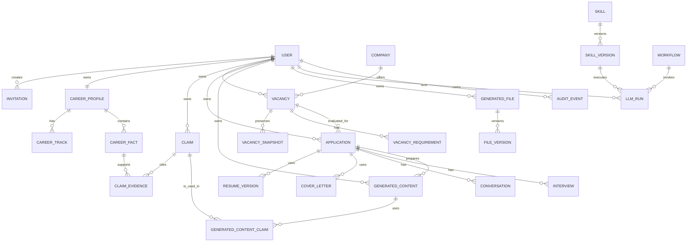

# Phase 06 Conceptual Data Design

This is a conceptual model, not a physical schema or migration plan.



## Entities, lifecycle and privacy

| Group | Entities and lifecycle | Provenance / audit / privacy |
|---|---|---|
| Identity | User, Invitation, UserSetting | invitation/security events audited; identity data private PII |
| Career | CareerProfile, CareerTrack, EmploymentHistory, CareerFact, Achievement, Education, Language, Skill, SalaryExpectation; fact `PENDING/CONFIRMED/REJECTED/DEPRECATED` | source/excerpt/extraction/confirmation provenance required; private sensitive PII |
| Claims/content | Claim, ClaimEvidence, GeneratedContent, GeneratedContentClaim, ResumeTemplate, ResumeVersion, ResumeChange, CoverLetter, GeneratedFile, FileVersion | private user-owned aggregates; every candidate-facing artifact traces to valid confirmed evidence |
| Employer/workflow | Company, CompanyContact, CompanyResearch, Vacancy, VacancySource, VacancySnapshot, VacancyRequirement, Application, ApplicationStatusHistory, Conversation, ConversationMessage, ConversationFact, Interview, InterviewQuestion | raw snapshots separate from normalized data; private per user unless explicitly system reference data |
| Research | ResearchSource, ResearchFinding, ResearchRule | source/version/date preserved; policy-scoped access |
| AI | LlmProvider, ModelPolicy, Skill, SkillVersion, Agent, Workflow, PromptVersion, LlmRun, EvalRun | version/policy/actual-model/context provenance and validation retained; credentials never in runs |
| Audit | AuditEvent | append-oriented; actor/target/action/time/correlation; minimal PII, no secrets |

## Ownership

Career Profile, Vacancy, Application, Conversation, Interview, generated file/content, Claim and LLM run are private aggregates directly owned by a User; children inherit that owner through the aggregate.

`ClaimEvidence` may reference only a same-owner CareerFact. `GeneratedContentClaim` links same-owner GeneratedContent and Claim. Cross-user chains are invalid:

```text
GeneratedContent.owner = GeneratedContentClaim.owner = Claim.owner = CareerFact.owner
```

Server identity comes from authenticated context and trusted relationships, never client `user_id`. Direct/nested lookup, queue payload, cache key, file access and AI context are owner-scoped. Admin capability does not imply private candidate-data access.

Lifecycle deletion is deliberate: approved artifacts, raw sources, provenance and audit are retained/anonymised/tombstoned according to policy rather than blindly cascade-deleted.

## Provenance vs audit

Provenance answers why content exists:

```text
Source
→ extracted fact
→ human confirmation
→ CareerFact
→ ClaimEvidence
→ Claim
→ GeneratedContentClaim
→ Generated Content
```

A Claim is valid only when supporting facts are same-owner and `CONFIRMED`. Missing/invalid provenance blocks generated content.

Audit answers who did what to a system resource. It is append-oriented and is not evidence for truth.

Minimum audit-worthy areas include invitations/account security, Career Fact lifecycle, Claim lifecycle, approved generated/application artifacts, credentials and exceptional administration/security actions. Audit never stores plaintext secrets or credentials.
