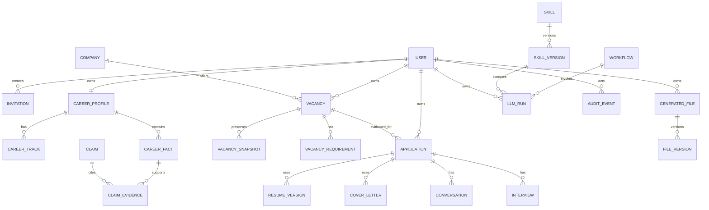

# Phase 06 Conceptual Data Design

This is a conceptual model, not a physical schema or migration plan.

## Entities, lifecycle and privacy

| Group | Entities and lifecycle | Provenance / audit / privacy |
|---|---|---|
| Identity | User, Invitation, UserSetting; invitation `created/revoked/used/expired` | invitation events audited; identity/setting data is private PII |
| Career | CareerProfile, CareerTrack, EmploymentHistory, CareerFact, Achievement, Education, Language, Skill, SalaryExpectation; fact `PENDING/CONFIRMED/REJECTED/DEPRECATED` | source, excerpt, extraction/confirmation actor and time required; private sensitive PII |
| Claims/content | Claim, ClaimEvidence, ResumeTemplate, ResumeVersion, ResumeChange, CoverLetter, GeneratedFile, FileVersion | immutable approved versions cite confirmed facts; approval/render/file events audited; private |
| Employer/workflow | Company, CompanyContact, CompanyResearch, Vacancy, VacancySource, VacancySnapshot, VacancyRequirement, Application, ApplicationStatusHistory, Conversation, ConversationMessage, ConversationFact, Interview, InterviewQuestion | raw snapshots preserve external source separately from normalized data; private per user unless explicitly system reference data |
| Research | ResearchSource, ResearchFinding, ResearchRule | source/version/date preserved; access is policy-specific, not automatically public |
| AI | LlmProvider, ModelPolicy, Skill, SkillVersion, Agent, Workflow, PromptVersion, LlmRun, EvalRun | version, selected policy/actual model, context provenance and validation result retained; credentials never stored in runs |
| Audit | AuditEvent append-oriented | actor, target, action, timestamp, correlation metadata; minimal PII, no secret/raw credential |

## Relationships, ownership and deletion

Career Profile, Vacancy, Application, Conversation, Interview, generated file and LLM run are private aggregates directly owned by a User; related records inherit ownership through their aggregate. Company may be shared/system reference only when no private employer context is exposed; otherwise a user-owned company context is used. Provider, policy, Skill, workflow, prompt and research rule may be system-owned; a user credential remains private.

Server derives owner from authenticated context, scopes every direct/nested lookup, queue payload, cache key, file access and AI context, and never trusts client `user_id`. Admin capability does not grant implicit private-data access: an exceptional authorised action must be explicit and audited. Cross-user enumeration returns no resource information.

Deletion is lifecycle-driven: approved artifacts, raw sources, provenance and audit records are retained according to policy or anonymised/tombstoned where legally required; they are not blindly cascade-deleted. File binaries are removed only after authorised metadata/lifecycle processing and hash-aware reconciliation.

## Provenance vs audit

Provenance answers why content exists: `Source → Extracted fact → human confirmation → Fact → Claim → Generated Content`; it carries source type/id/version/snapshot, excerpt/reference, extractor/Skill/Prompt version, policy/actual model, actors and timestamps. A Claim is valid only when all supporting facts are `CONFIRMED`. Audit answers who did what to a system resource and is append-oriented; it is not evidence for truth.
