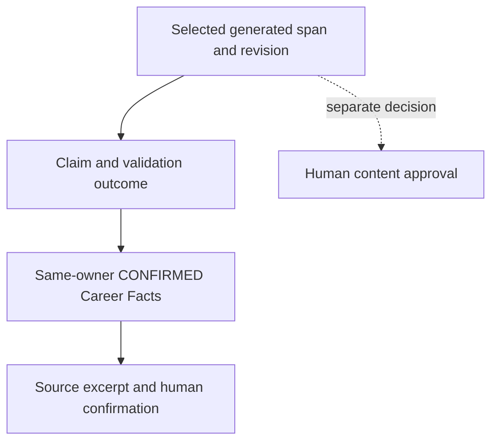

# Application Workspace

## Direction and implementation boundary

**Concept B / Application Workspace** is the selected CVortex direction. The user's working context is one opportunity, with its vacancy, decisions, evidence, draft materials and employer context. This is an accepted **target interaction contract**, not a claim that these surfaces are shipped. Pixel values and fixture status labels in [Concept B](../../research/design-redesign/concept-b/index.html) are exploratory inputs.

Brand, primitives, semantic states and accessibility remain in [Design Foundation](Design-Foundation.md). [Reconciliation](Concept-B-Reconciliation.md) records differences, actual evidence and implementation dependencies. This document adds product patterns to that system rather than replacing it with a second design system.

## Canonical global information architecture

| Destination | Responsibility | Contextual content / current boundary |
| --- | --- | --- |
| **Today** | A small review/next-action inbox linking into the same selected workspace | Only real pending reviews, stale analyses or user-entered actions. No invented urgency, application totals or interview agenda. Initially a projection of available Career/Vacancy/draft data. |
| **Opportunities** | Saved vacancies before and after an application exists; list → selected workspace | Current Vacancy, requirements, deterministic match, saved preparation and drafts. Full application lifecycle waits for its domain slice. This is the primary job-work destination. |
| **Career** | Owner's canonical Fact Base, pending review, Claims and career evidence | Current manual/pasted-source review; future tracks/files are enabled only after implementation. Returning to the originating opportunity restores its context. |
| **Employers** | Employer-level history across opportunities | UI label for Company + private employer context, not a renamed database entity. Requires independently confirmed association and an implemented owner-scoped model; initially a clear unavailable explanation, without synthetic histories. |
| **Settings** | Account and available AI connection/context preferences | Current supported controls only. Admin-only Diagnostics is a utility entry here, retaining `/diagnostics` and server authorization; it is not a sixth job-search destination. |

Why five destinations: Career owns reusable candidate truth; Opportunities owns job-specific work; Employers owns cross-opportunity consistency; Settings owns operational choices; Today answers what needs attention and deep-links to the other four. Documents and Research are artifacts/context, not competing global destinations. A seven-stage wizard would incorrectly make nonlinear application work sequential.

**Documents** live in the active Resume/Cover/Materials context with exact version and approval state. A later library can be reached from Career (reusable inputs) or Opportunities (prepared artifacts), with owner/scope filters; no library is implied today. DOCX/PDF output remains governed by ADR-0016 and M2.

**Research** lives under Employer context for company findings, under Requirements/Match for relevant external findings, and under Career for reusable recruiting rules when implemented. Sources retain date, URL, provenance and freshness; external research never supports a candidate Claim in place of confirmed Career Facts. A later searchable knowledge collection is subordinate navigation, not a new global destination by default.

## Vacancy ↔ Opportunity ↔ Application

| Term | Contract |
| --- | --- |
| Vacancy | Existing user-owned vacancy with immutable source snapshots, requirements and analysis. It can exist without an Application. |
| Opportunity | Presentation context combining a Vacancy and any related existing preparation/Application. No `Opportunity` table, API resource or new state machine is authorized. |
| ApplicationPreparation | Current saved preparation/draft aggregate attached to the vacancy. It is not evidence that an employer application exists or was sent. |
| Application | Conceptual user-owned record from Phase 06/M2 linking vacancy, confirmed employer association, exact materials and lifecycle/history. It is not yet implemented here. |

Conceptual Vacancy → Application cardinality is preserved. If multiple Applications later exist for a vacancy, show a separate application/version selector; never merge their approvals or conversations. Until then the header says **Vacancy / preparation**, not a fabricated sent Application. Imported company name is untrusted metadata, never sufficient for joining private Employer Memory.

## Workspace anatomy and navigation

Desktop composition: global navigation + opportunity list + main work surface + optional context inspector. Preserve readable working width before making every pane persistent. No fixed prototype column widths are adopted as tokens.

The header always identifies role, company/name availability, whether this is vacancy/preparation or a real Application, the corresponding domain status, and the next safe human action with any blocking reason. Salary amount/basis/currency/period and work format are the compact second line when known; unknown values are labelled unknown. Priority is secondary user-owned metadata when supported. None is inferred from a fixture or converted into a fake completeness score.

Keep **analysis status**, **recommendation class**, **draft review/approval**, **application lifecycle**, **priority** and **next action** separate. `APPLY` means decision support, not submission. `Prepare/Communicate/Interview` in the prototype are demonstrations, not newly approved persisted states. Use actual API enum mappings and expose unknown values safely; do not invent lifecycle transitions in presentation.

Use **local section links** inside the selected workspace, with a current-section indication and stable deep-link semantics. This navigation is not an ARIA tab widget pretending to be browser navigation. Desktop may display a wrapping link row; compact screens use a labelled section menu. Section choice does not change the selected opportunity or discard unsaved review text.

| Primary section | Contents / secondary navigation | Availability |
| --- | --- | --- |
| **Overview** | Next action, explicit blockers, brief match/gaps/risks, artifact readiness and recent activity | Summaries only from currently available data; no fabricated readiness. |
| **Requirements & Match** | Requirements and source wording; seven match dimensions; gaps, unknowns and risks; raw vacancy disclosure | Current Vacancy/analysis contract. Separate local anchors/filters rather than two competing global pages. |
| **Materials** | **Resume / Cover** subnavigation; recommendations, diff, exact revision, provenance and approval; files/export later | Current recommendation and cover drafts. Label recommendations honestly; no claim that a complete ResumeVersion/document exists. |
| **Employer context** | Company findings, confirmed commitments and history; **Conversations / Interview** subviews when available | Deferred employer/journey capabilities remain explicitly unavailable. Embedded vacancy AI chat is a contextual analysis tool, distinct from recruiter conversations. |
| **History** | Available source/analysis/preparation revisions and decisions; later lifecycle/conversations/interviews/outcome | Only recorded events. History does not substitute provenance. |

Hide unavailable contextual subviews with a discoverable explanation where it matters; a disabled control includes why and prerequisites. Global target destinations may display unavailable-state copy during staged rollout. Never fill future surfaces with live-looking demo records.

Selection preserves list query/filter/scroll and active section. Back/forward and deep links must restore the same location. When a selected record falls outside a filter, show an explicit selected-record notice or return to the list; never switch silently. Fetches, pending results and inspector content are scoped to the selected owner/record/revision; late results cannot overwrite another opportunity. Changes with unsaved text offer Stay/Discard before navigation; do not promise server autosave until it exists. Production URL mapping is a bounded shell-task decision, not an API redesign.

## Context inspector

The inspector is a named complementary region for the **selected requirement, dimension, Claim, recommendation or employer commitment**. On wide desktop, opening a relevant evidence/reason control shows it next to the main task. With no selection it is closed; a compact context entry remains available. A blocking reason always remains inline even when the inspector is closed.

Show the selected item's title/type/state, source/revision, why it is relevant, concise evidence excerpts and links to full source. Provenance exposes content span/revision → Claim → same-owner `CONFIRMED` Career Facts → source and human confirmation metadata. Audit actor/time is separate from truth support. Raw vacancy/recruiter text is labelled untrusted and rendered as text.

An explicit selection updates the unpinned inspector. **Pin** keeps the current item within that same opportunity while the main task changes; show the pinned item label and stale state. Pin is session UI state, not permission to freeze old evidence. Switching opportunities clears selection/pin and removes old context before loading new context. Revalidation updates or invalidates pinned evidence. **Close** collapses the inspector and returns focus to its trigger; **Unpin** returns to selection-following behavior. Evidence never follows hover alone.

Employer context appears only for a confirmed same-owner employer association with available data. Missing association says **Employer context unavailable — confirm association** when such a workflow exists; do not join by imported name. Current analysis chat's unavailable employer-memory boundary remains intact.

At intermediate width use a focus-managed context drawer. On mobile use the separate **Context / Evidence** level below; long evidence receives full readable width rather than a miniature popover. Short explanatory tooltips/popovers do not host approval or critical blocker resolution.

## AI recommendation review

Canonical order: **Recommendation → Reason → Evidence → Risk → Before / After → Accept / Edit / Reject**. Keep the proposal adjacent to the affected requirement or draft content, not in a mandatory chatbot page. Evidence summary precedes the diff; expanding the full trace is optional. A risk or block cannot be hidden behind disclosure.

Accept attaches the validated exact suggestion to draft preparation; it does not confirm a Career Fact, approve all materials or record an application. Edit creates/updates an unapproved revision and revalidates against current evidence. Reject retains a recorded rejection where supported and performs no provider operation. Separate **Approve content** identifies the exact current revision, validation status and user decision. Editing or dependency changes invalidate eligibility/approval according to the governing API; rendering a green badge cannot grant approval.

Meaningful confidence must identify its scope, source and limitations. Current extraction confidence is an uncalibrated inference signal: show text such as **AI extraction — review source**, with numeric details only if a documented interpretation makes them useful. Deterministic match result is not probability. No universal AI/ATS/interview percentage, synthetic certainty bar or normalized aggregate score.

| Analysis / review state | Required UX |
| --- | --- |
| Not analyzed / empty | Preserve source; name missing analysis/evidence. Explicit Analyze only when configured and authorized. No fabricated match. |
| Loading / running | Name operation and selected vacancy; status/live feedback; keep safe existing context readable. Disable only unsafe repeated/provider actions. No invented progress. Cancellation only if supported. |
| Failed | Problem → known cause/unknown cause → impact → safe next action; preserve known saved source/drafts, but do not assert all data unchanged. Reference code safely. No raw stack/prompt. |
| Stale | Visible reason (source/evidence revision changed), analysis time/version and re-analysis action; stale content is not current evidence for new approval. Retain historical wording with a stale label. |
| Re-analysis | Explicit user action, context preview/consent for provider transmission where required; configured provider path, no silent paid fallback. Honor supported cooldown/Retry-After and ownership/revision fences. |
| Failed draft review | Retain entered text where safe; show field/revision reason and recovery. No “accept anyway” for absent provenance. |

The prototype's whole-screen Error simulation illustrates a state only. Production uses operation-level errors in the current workspace whenever possible. Retry repeats the named failed operation; it does not silently restart unrelated analysis or generation. Preserve existing Error Center cooldown semantics: provider-backed generation/edit/accept/approve are gated by a positive bounded delay; provider-free Reject remains available.

## Truth-first progressive disclosure

Normal state: content shows **AI recommendation / unapproved draft**, a labelled evidence link, approval state and visible blocker if present. Do not paint an entire generated paragraph `CONFIRMED`; that state belongs to Career Facts, while Claims have validation outcomes and content has its own approval state.

| Condition | Presentation / allowed action |
| --- | --- |
| Evidence inspection | Selected span/Claim trace in inspector; exact excerpts, revision and confirmation metadata. Return to unchanged draft position. |
| Missing or invalid provenance | **BLOCK** with missing link/fact named; disable use/approval of affected content; repair evidence or remove unsupported wording. |
| Conflicting valid evidence | **USER_RESOLUTION_REQUIRED** with both statements, sources, dates/scope and explicit resolution. A confirmed employer contradiction remains blocked until governing validation passes after resolution. |
| Pending Career Fact | **Pending confirmation**, labelled source; open Career review. Neither recommendation acceptance nor source extraction confirms it. Return to the originating task and revalidate after explicit confirmation. |
| Deprecated / rejected evidence | Preserve historical trace and status; not eligible support for a new Claim. Refresh or remove affected content. |
| Blocked generation | Show which prerequisite fails and safe repair action. No skip gate, forced approval or universal confidence override. |

Frontend copy represents server decisions; the API remains the enforcing boundary. Screen visibility, cached evidence or admin role grants no private-data authority.

## Employer Memory as decision context

Show a compact **What we already told this employer** summary in Overview/Employer context and near materially affected recommendation review. Order: unresolved contradictions/commitments → last confirmed salary/work-format expectations → previously used approved Claims/material versions → recent relevant conversation/interview → previous vacancies. Salary includes basis/currency/period/date; do not compare incompatible gross/net/month/year values as a contradiction.

Every item links to exact approved content or explicit confirmed statement, its application/conversation source and date. A sent-message record and an approved draft are different states; do not say “already told” for an unsubmitted approved draft. Important commitments include follow-up dates, availability and promises only when recorded/confirmed. A timeline supports these summaries but is not the memory's primary interface. Unknown/no history/unavailable association are distinct states.

Imported recruiter messages remain untrusted. They may propose pending facts, never update confirmed candidate truth or erase prior commitments. Compare new wording against the same confirmed employer association. Explain both sides of a contradiction and the resolution required; never merge similarly named companies automatically or infer employer history from free text. Actual EmployerConsistencyCheck/general Employer Memory implementation is deferred to its authorized domain slice.

## Responsive transformation

| Layout pressure | Composition |
| --- | --- |
| Compact and remaining narrow widths (<768 CSS px) | Single primary level: **Opportunities list → workspace → Context / Evidence**. Browser Back and labelled Back restore list filters/scroll or the initiating content/focus. Local section menu retains selected opportunity; global navigation is a labelled compact menu, without inventing icon-only destinations. |
| Tablet (≥768, insufficient width for all panes) | Workspace first; opportunity list is a separately opened side panel; context is an overlay/drawer. Only one transient panel at a time, Escape/close/focus return. |
| Desktop (≥1024 when readable widths fit) | Persistent global navigation and list + workspace. Context can remain a drawer; never force three data panes because a breakpoint exists. |
| Wide (≥1440 when readable widths fit) | List + workspace + inspector alongside a compact global rail. Inspector is optional/closable; cap prose width and avoid stretching diff/table columns. |

These thresholds reuse canonical tokens; available space, zoom and text length may collapse panes earlier. Mobile is not the prototype's long stacked list/task/inspector page. Selection, unsaved-review guard, current revision, blockers and approval survive every layout. Mobile Before/After stacks with explicit labels; long identifiers wrap or have safe copy controls. No page-wide horizontal scroll except labelled intrinsically wide tables. PWA offline state permits supported local reading and explains unavailable actions; no offline approval/queued employer action is invented.

## Accessibility and state acceptance

Apply all Design Foundation criteria: semantic landmarks, labelled navigation/current location, 44×44 practical touch targets, ≥12 px metadata/16 px long reading text, contrast, logical keyboard order, visible focus, reduced motion and status announcements. Skip navigation/list to the main task. Pane resize/reorder cannot alter reading order or obscure critical actions.

Selection change announces the named opportunity and loading/result state; do not steal focus if the user moved elsewhere. Drawers/dialogs announce their purpose, manage focus and restore the trigger; deletion/filter disappearance returns to a safe list heading. Verify 320/390/768/1024/1440 widths, real 200% zoom, long Russian/English copy, keyboard and screen-reader navigation. Browser prototype inspection is evidence for direction only; production/assistive-technology acceptance remains required per bounded slice.
