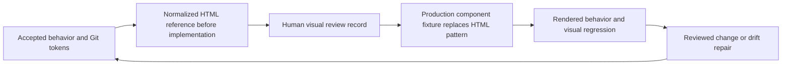

# Git Design Handoff and Visual Review

## Authority and current readiness

Under [ADR-0024](../03-ADR/ADR-0024-git-design-reference-workflow.md), design review is local-first and versioned in Git. [Figma Handoff](Figma-Handoff.md) is historical/superseded; Figma is optional. [ADR-0014](../03-ADR/ADR-0014-git-design-tokens.md) remains the machine-token decision.

| Concern | Canonical source | Present readiness |
| --- | --- | --- |
| Brand, accessibility, semantic states, token/component conventions | [Design Foundation](Design-Foundation.md) | Accepted specification; brand/token values retained. |
| IA / Application Workspace behavior | [Application Workspace](Application-Workspace.md) | Accepted target direction; production migration not implemented. |
| Machine values | [`brand/tokens/cvortex.tokens.json`](../../brand/tokens/cvortex.tokens.json) | Existing canonical DTCG JSON; no values changed by reconciliation. |
| Visual reference per pattern | Reviewed executable reference identified by manifest revision/state/viewport | Concept B is **exploratory**, browser-inspected; normalized reviewed reference/manifest is the first bounded task. No screenshot is newly marked human-approved. |
| Implemented presentation | Production component fixture view importing real theme/components | Existing production UI exists; isolated workspace fixture views are planned. Production code is not automatic approval authority. |
| Visual drift evidence | Reviewed baselines + actual/diff capture in a pinned environment | Existing concept and Error Center screenshots are dated synthetic evidence; production visual-regression harness is planned. |

Different concerns have explicit authorities; conflicts do not resolve by whichever canvas or screenshot was edited last. Behavioral/security rules and machine tokens constrain visual references. A discrepancy opens a review, and the intended change is recorded in the relevant source before baseline approval.

## Handoff lifecycle

Keep one active visual reference per pattern, identified by a small manifest under `docs/07-Design/reference/` when that task creates it. The manifest is a locator/review record, not another token/theme source. Do not create an independent production component clone for reference maintenance.

Minimum record:

| Field | Required content |
| --- | --- |
| Pattern / scope | Stable PascalCase component/pattern name and behavior-document anchor. |
| Lifecycle | `draft`, `reviewed` or `deprecated`; only `reviewed` is a visual baseline. |
| Implementation availability | Reference-only, existing implementation, or deferred domain capability. |
| Active reference | Exactly one HTML or production fixture path, with source revision. |
| Token authority | Canonical JSON path + revision/hash; any generated CSS is explicitly derived. |
| States / viewport | Explicit scenario/fixture ID, layout dimensions, loading/empty/error/stale/blocked/approval cases. |
| Capture conditions | Browser/build, OS/container, font source/version, timezone/locale, motion/clock settings. |
| Review | Named human reviewer, date, outcome, screenshot/diff paths and unresolved limitations. Agent browser checks are recorded separately. |
| Retirement | Replacement path/revision and reason when HTML is replaced or a pattern deprecated. |

Historical artifacts retain their dates and evidence boundaries. A reviewer cannot approve all states by viewing only the happy-path screenshot. If human review is pending, record it; the manifest remains `draft`. Direction selection does not stand in for pixel/state acceptance.

## Tokens and component mapping

Resolve aliases from the canonical JSON; validate missing/cyclic references and supported token types/units before CSS derivation. Preserve `font.tracking` rem units and alpha compositing. Compare the production subset against canonical values; do not trust its `derived from` comment as an executable guarantee. The first task scopes a deterministic reference derivation; production theme automation is a separate justified change.

Component names use PascalCase nouns; tokens use lowercase dot paths; CSS derivations use consistent kebab-case names. Existing `CareerWorkspace`, `VacancyWorkspace` and `ApplicationDraftPanel` remain actual implementation names; taxonomy candidates do not authorize file renames/refactors. Do not introduce a primitive library or install Lucide/Storybook on the strength of a taxonomy alone.

## Change and review procedure

1. Identify the bounded change and affected behavior/token/reference states; run the repository write preflight.
2. Update the accepted specification when intent changes. Token changes require canonical JSON review and downstream reference refresh; no independent CSS master.
3. Before implementation, normalize only the affected HTML reference with synthetic fixtures and token-derived values. After implementation, exercise the actual component fixture and retire its HTML counterpart.
4. Capture normal and edge states with pinned inputs and environment. Review desktop/mobile/zoom, long text, missing evidence and failure/approval states.
5. Record automatic checks and human visual/accessibility review separately. Inspect intended diffs before accepting a new golden baseline; never auto-approve by `--update-snapshots` or mask blockers/focus/provenance.
6. Update mapping, docs and state, then stop at the bounded task. Delivery/publication still follows explicit user authorization and Git policy.

Rollback restores the previous versioned specification/token/reference mapping and reviewed baseline together where affected. No backend/API/schema migration is implied.

## Validation contract for future implementation

Use the narrowest meaningful component/interaction checks first, then frontend ESLint, TypeScript, Vitest and production build when frontend code changes. Add local Playwright screenshot comparisons and targeted automated accessibility checks only in the separately authorized tooling task; select/pin compatible packages then. No hosted visual service is required.

Rendered checks include desktop/mobile/reflow, real 200% zoom, contrast of selected/focus/error states, reduced motion, keyboard/return-focus, manual screen-reader reading/announcements, async stale-selection handling, provenance/approval gates and no external requests from synthetic fixture previews. Use fixtures/clock settings to make timestamps deterministic; don't hide content whose correctness matters. Baseline platform differences are explicit rather than tuned away with a broad diff tolerance.

[Playwright documents environment-dependent rendering](https://playwright.dev/docs/test-snapshots) and [the limits of automated accessibility testing](https://playwright.dev/docs/accessibility-testing). These support the workflow; this task has not installed/run a new visual regression or axe harness.

## First bounded task

Execute only when started in a new authorized work block: [Application Workspace reference foundation](../../.agents/tasks/application-workspace-reference-foundation.md). It produces a token-derived, reviewable local reference and state manifest, not a production UI migration. [Reconciliation roadmap](Concept-B-Reconciliation.md#bounded-frontend-roadmap) describes subsequent conditional outcomes; it is not authority to advance into them.
